# 运算放大器 - 笔记 01 

> 前言：因为最近因为智能车备赛要用到运算放大器，我想对比尝试更多方案，而不是直接“无脑”祖传方案（叛逆的小伙心理）。
>
> [TOC]

# 一、 基本知识

- 首先，必定是先学习运放的基本知识。内部原理不深究，属于模电课本知识（好像是由几个三极管组成的，而三极管又是由二极管组成的……）。非要纠结的可以看看这篇笔记：  [模拟电子技术之运算放大器](https://blog.csdn.net/zbp_12138/article/details/106568446)  ，感觉写得挺全的，和课本内容差不多，就是拿着曲线特性讲。
- 我应用只关心它的 *外现特性*（自造词），即“**虚断**”和“**虚短**”。个人的白话理解：前者指**同/向反向输入端**的电流情况，后者指**同/向反向输入端**的电压情况。当分析电流时就认为两个输入端是断路的，当分析电压时就认为两个输入端是短路的。然后结合**基尔霍夫电压定律**（也就说电流电压关系公式），就可以推导出**总输出**和**总输入**的比值关系，也就是运算放大器的**增益A**。
- 知道虚断和虚短两个意思后（不能明白就暂时死记一下），然后就看几个**经典电路分析**，应该就能有概念了。推荐这篇笔记：[运算放大器典型电路及原理](https://blog.csdn.net/qq_41069421/article/details/91396768) ，虽然公式列得不好看，但是图示和分析都挺全的。

# 二、 经典电路分析

- 在分析之前，先明白一点：关于运算放大器的**同反向输入端**，其实只是用于区分两个引脚的代号，并不是代表不同功能。（[查自百度百科](https://baike.baidu.com/item/%E8%BF%90%E7%AE%97%E6%94%BE%E5%A4%A7%E5%99%A8/7083620?fr=aladdin)，原理，第一、二段）

## 1. 反相放大器

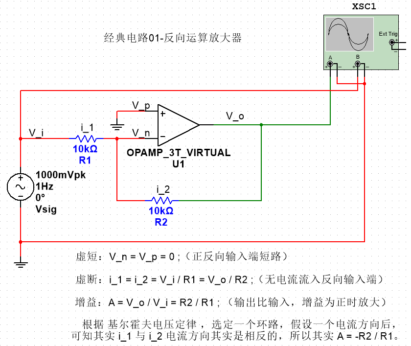

- 使用`Multisim`软件 - 工具 - 电路向导 - 运算放大器向导 - 反相放大器，可以快速生成，再自己加上示波器进行测试。源信号的频率减低到`1Hz`，方便观察图像变化。

> 分析我都直接注释在图上了，软件没有公式编辑器，所以看公式略显麻烦。（才发现原来翻译也有不读“向”读“相”的，不知道有什么区别）示波器显示如下图。

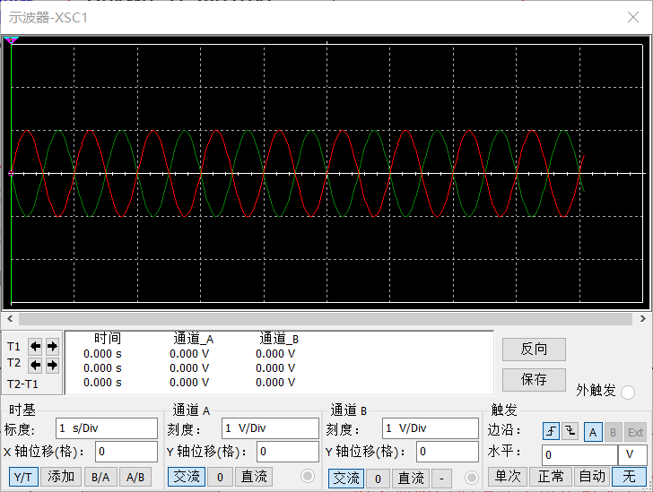

##  2. 同相放大器

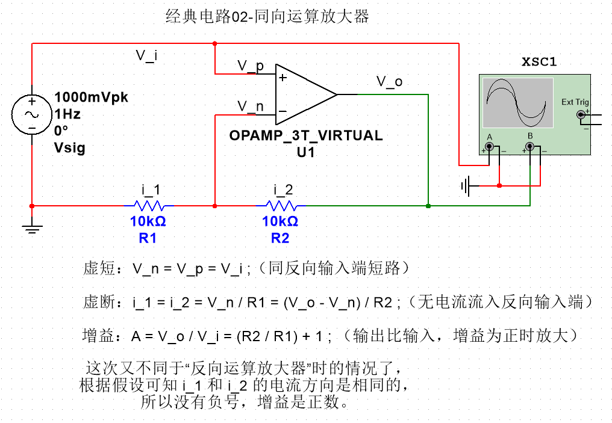

> 因为软件工具向导里没有直接生成的，在反相的基础上修改一下即可。分析同样都在图上了。我不赘述了。示波器显示如下图。

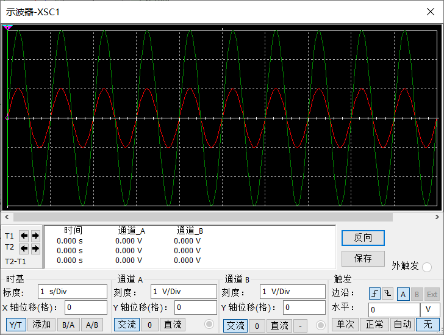

## 3.  总结

- 我尝试把"反相放大器"和“同向放大器”的运算放大器的输入端引脚交换后观察图像，发现输出并没有变化。证实了“**2个引脚只是代号不同，功能上是一样的**”。

> 在实际电路中根据情况，是有全部别。这是个小坑，下一节“*实战运用* ”说明。

- 所以分析运算放大器电路时主要就是依据“虚短”和“虚断”来推导增益。

> 还有很多经典电路，比如：加法器、减法器、跟随器、比较器之类的，还有多级组合运放之类的。同时，还有一些使用的注意事项：[运算放大器使用的六个经验](http://www.elecfans.com/analog/20161128452967.html)。 ~~大部分我都没用过，就不说了~~。

# 三、实战运用

- 举两款实际使用的运算放大器芯片：`LMV358` 和 `OPA4377` 。目前我只用过这两款，是用来放大“电感切割磁感线”时产生的电压。
- 设计需求：输入为`幅值200mV`的正弦波，要求输出直流电压，连接至MUC（单片机）的AD口。

> 另外输入的正弦波还有`频率200KHz`等特性，我暂未深究运算放大器的其他特性，目前针对说明“能用”就行的放大电路怎么设计，比如调放大系数、整流滤波等。

## 1. LMV358

- 这款运放IC很便宜，[某宝](https://shop131282813.taobao.com/search.htm?userId=&shopId=131282813&view_type=&order_type=&spm=0&search=y&keyword=MV358) 上八引脚双路的封装一般价格在一元RMB左右。关于相关特性的介绍，推荐卓大大推文：[实验电路的放大器伴侣：LMV358](https://zhuoqing.blog.csdn.net/article/details/106296105)。

> LMV358型号还有很多不同的后缀命名，琳琅满目看不过来。初选电子原件直接晕了，其实只是厂家和部分参数不同，~~我觉得个人普通使用应该没什么差别~~。

- LMV358输入电压范围 `Vcc = 2.7 to 6V`，供电电压决定了运算放大器输出的最高电压，比如：3.3V供电，放大后的输出电压最大就是3.3V。在触碰到最大极限前可按照`放大系数A`计算输出电压，如果超过了就只会保持在3.3V。
- 一般要求输出最大电压不宜错过单片机的工作电压，以免“冲”坏单片机AD口引脚。所以只需要设置为和单片机一样的供电电压（**存疑**），就可以。 常见的有5V和3.3V。

> **重点分析**：另一个问题，如果一个3.3v单片机要读取255的AD值——即可能接收略大于或等于3.3v的AD输入。那运放也设置3.3v电源的话，那就不能到达满值了（？）。因为如果输出超过3.3v后，输出的就是方波，而不是输出原输入波形，这样就不好…（比如在`OPA4377`应用中）…所以应该还是3.3v单片机使用时，运放就设置5v的电源。AD输入电压稍微大一点的话，应该不会太大问题。

> LMV358-8P有2路运放，但只有一对正负极，在`Multisim`软件中也只需要连接其中一对即可，另一对引脚会自动被标上“红叉”。

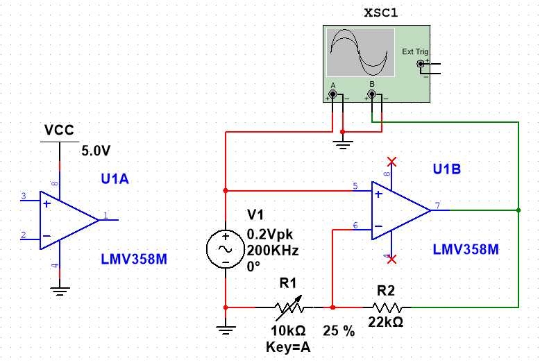

- 我只用其中一路作示范，对比上一节的**同相放大器**电路图，输入源、R1和R2的参数变了。为了能调节输出电压的大小，把R1换成电位器（滑动变阻器）。改变R1的阻值就可以改变`放大系数A`，可以用来适应不同的输入输出场景。下图为示波器显示。

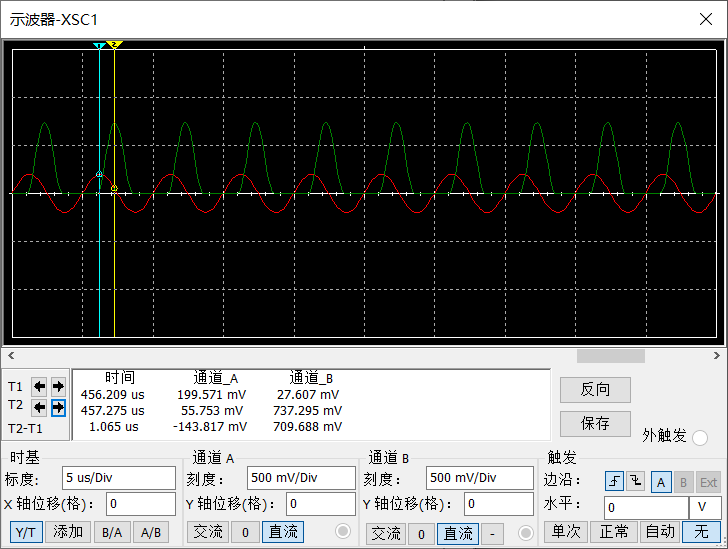

- 根据波形幅值可以计算放大了3倍多，同时有较明显的滞后延迟`1.065us`（占了一个周期5us的20%，还是很大的）。这好像是的LMV358的固有特性，如果把频率设置低一些，周期比较长时对比1us的延迟就可以忽略不计了。（~~不能解决问题就解决提出的问题的~~）

1. 提出问题 ：**为什么输出没有了负电压的部分？！**查了一下后知道，因为供电是直流供电而不是正负电源供电，所以不会输出负电压。本来想试试把输入的正负极发过来，但却仿真报错了，然后才想起来，LMV358工作电压范围已经限死了。
2. 提出问题 ：**如果将同反相输入端再次交换，还会像之前那样输出不变吗？**仿真后发现输出完全没电压，也就是说如果交换的话，输入就相当于负电压了，输出就直接为零。之前的实验中使用的都是软件自带运放模块，不用手动接电源，可以输出正负电压。所以其实反接之后波形相位应该发生了变化，其实我没发现。

> 所以其实在实际应用中，同反相是不能随意交换的。特别是直流电，在**同相放大器**中，输入信号一定要同相端输入，反馈信号一定是反相端输入。

## 2. OPA4377

- 关于`OPA4377`与`LMV358`的对比，也推荐卓大大的推文：[OPA4377低噪声5.5MHz带宽CMOS运放](https://zhuoqing.blog.csdn.net/article/details/106863330)。另外，立创平台也有一个基于`OPA4377`的开源电路设计：[OPA4377八通道运放 开源](https://oshwhub.com/Sirius214/OPA4377yun-fang)。基于这个开源电路，我在`Multisim`软件也搭建了一样的电路作测试（对应的模块居然都有，好强大的软件），下面围绕这个开源电路讲几个知识点。

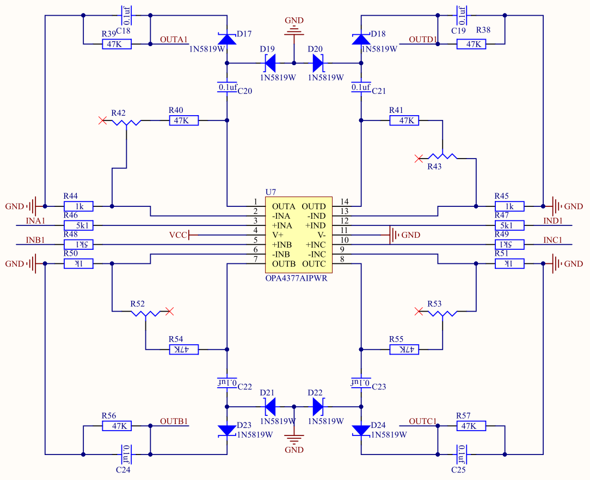

- `OPA4377`含有四路运算放大器，在上图设计中每一路都是一样的（强迫症，为了完全对称，我复制粘贴镜像画的）。所以只取其中一路来讲解。以下就是其中一路的仿真图，上面的原理图“不好看”，下面的仿真图特意按前几次试验的形式摆放反馈电阻。所以直观很多。

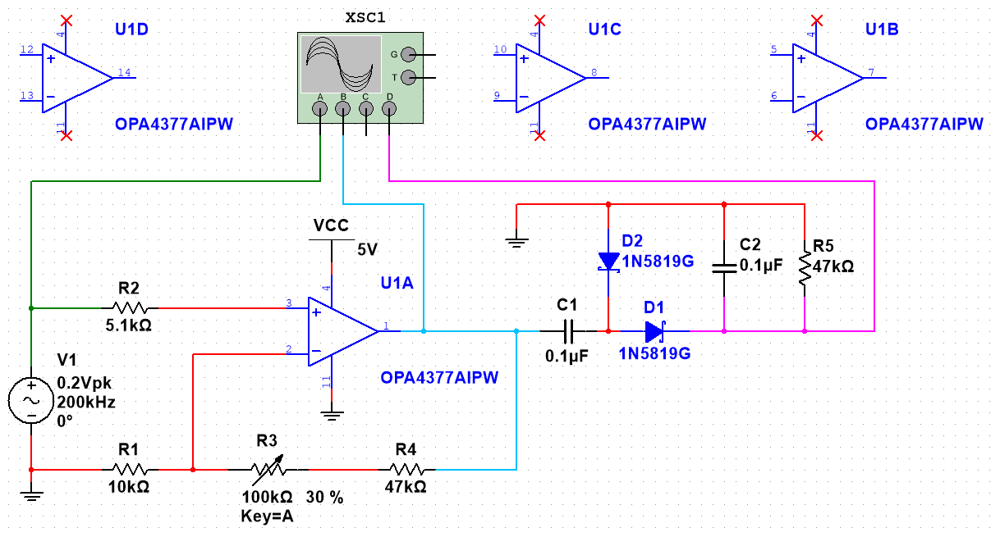

### 1） 基础同相放大器部分

- 先看左半部分的同相放大器部分，熟悉了不少。不同的是多了2个电阻。一个是输入端的限流电阻，一个是输出端的限流电阻（？），如果因为R3电位器可调，如果R3过小的话放大系数A就会接近1（相当于跟随器？）。为了设定一个最小放大系数和限流，所以也加了一个电阻。另外，为了方便计算，`A - 1 = (R3 + R4) / R1` 。R1选值时就选择10的倍数。

- 因为输入是幅值0.2V，我使用的是3.3V单片机，所以设置运放工作电压5V（根据上一节中 “**重点分析**” 的内容）。然后，输入0.2V，要求输出在 `2V~3V` 就差不多了。也就说放大10倍左右，所以我 `R3+R4` 设置了`147k~47k` 之间变化。下图为示波器显示。

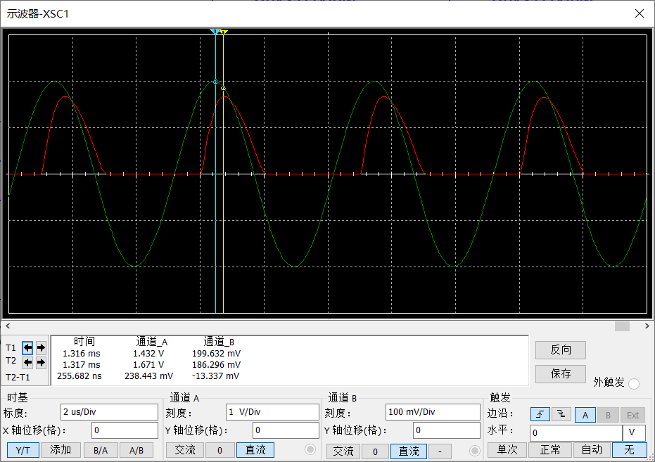

### 2）整流滤波部分

- 百度百科：将[交流电](https://baike.baidu.com/item/交流电)变换为直流电称为[AC/DC](https://baike.baidu.com/item/AC%2FDC)变换，这种变换的功率流向是由电源传向负载，称之为整流。经过运算放大部分后，我们已经得到了正弦波的正电压部分，单片机AD读取需要较稳定的直流电。所以需要整流滤波。
> 其实我也不怎么会，下面是我自己学习时的测试试验。另外，推荐一篇笔记：[吃透一切整流滤波电路](https://blog.csdn.net/u010552932/article/details/80921505)，（发现挺多内容模电书上也有）。

#### ①：模拟半波输出

- 从波形上看，正弦波经过直流的同相放大器后得到的半波形，就有点类似**半波整流**的效果。不过没有放大效果，而且还因为二极管压降了一点电压……电路图和波形图如下。

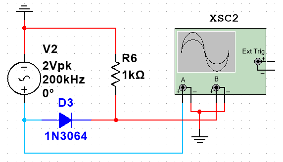

> 因为波形图是类似的，所以暂时使用上图电路代替运算放大器的输出波形。

#### ②：输出串联电容

- 然后串联一个电容看看效果。通过波形图可知加了电容后对输出是没影响的（为了方便查看把A通道的Y轴下移了0.2V，不然就会重合在一起看不出2条线）*。~~然后“反推”一下，电容的特性是隔直流同交流，也就是如果电压是变化的就跟着变化（持续充放电），如果电压是不变的输出就是0V（电容充满电后断路）。刚好，输入的半波波形的不变电压部分也是0，变电压部分则跟着变化，所以输入输出图像就一致了。~~*

> 1. 加个负载模拟真实情况，如果不加的话可能输出不一样。比如下面增加稳压二极管后的情况，如果不加负载处于开路状态，连压降都不会有。
>
> 2. 还发现个问题，原来波形是在变化的，一直下降，看③说明。根据波形还会下降的现象，上面的反推应该是错误理解。

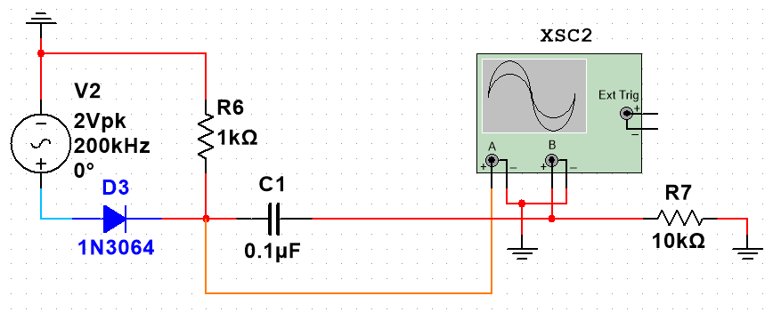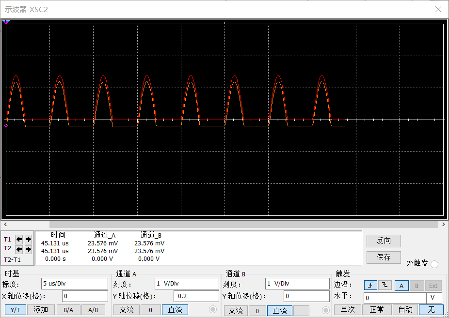

#### ③：输出串联稳压二极管

- 再增加一个`1N5819G`稳压二极管，对比经过前后的波形，会发现输出的还是半波，而且因为压降电压有所下降了。不过经过时间的推移，波形很快就产生了变化。

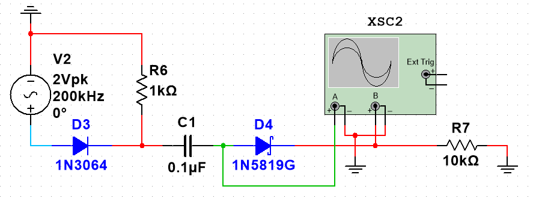

- 仿真软件显示才过去几ms，波形就变化成如下左图了。两个波形是一起慢慢下滑，然后红色的输出波形也开始慢慢有点变形。下右图是②试验中，经过一定时间后的图像。之后，我又放置了一段时间，发现波形下降到一定程度后就不下降了，稳定在一个高度。这时候再对比左右图，才得到加了`1N5819G`稳压二极管后的差别。

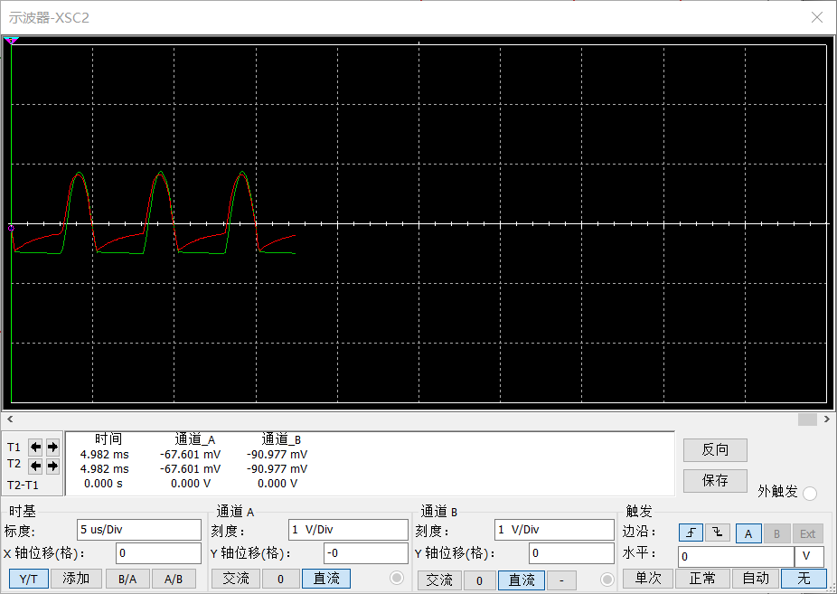

> 2021.05.15：我现在还不知道为什么串联一个电容后波形就会明明下降，然后稳定在一个高度。最后的效果就是输出一半负电压一半正电压了。 

#### ④去除负电压

- 显然我们并不想要负电压，为了去除负电压，在对地之间再加上一个`1N5819G`稳压二极管。这样就图像就不会下降了，稳定的输出真半波波形。*我再反推理解一下，二极管只能正向导通，所以如果对地接一个二极管，那就不会出现比地还低的电压。*波形图显示如下。（~~不知道为什么橙色线又有点上升了，2333~~）

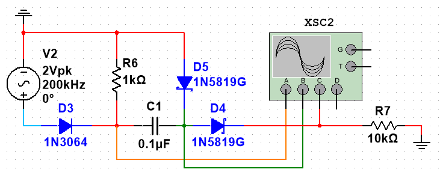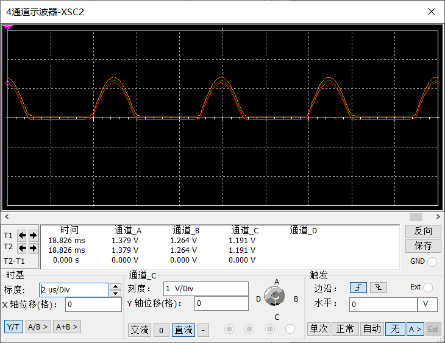

#### ⑤滤波电路

- 最后我们再加上最简单的电容滤波电路，从波形图上可以看出，经过一个简单滤波电路后输出的就是直流电了。

> 因为加上滤波电路后形成了回路，所以把负载电阻去掉。这样更加符合假设的AD读取情况。

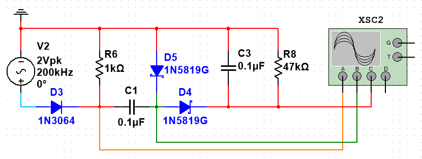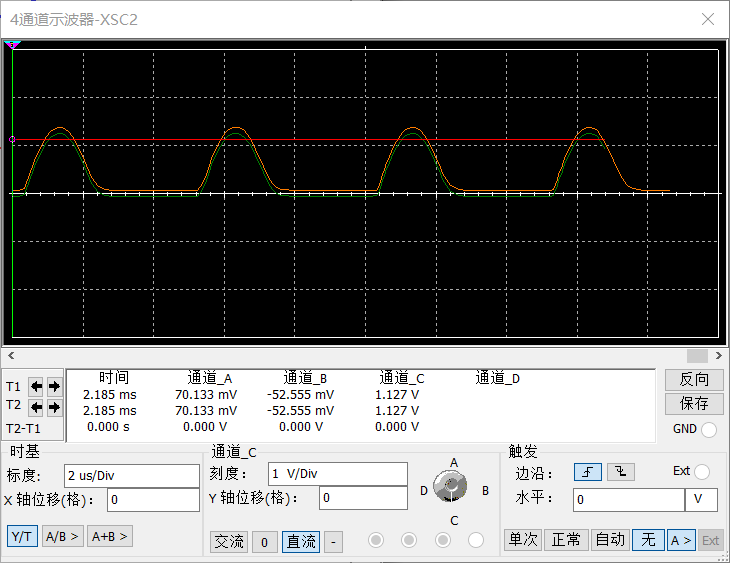

#### ⑥总结

- 没想到其主要作用，将半波转换为直流的是最后一步的滤波电路。在实验分析之前我还以为是`1N5819G`稳压二极管的作用。然后我再做 “去电容和二极管” 的对比实验。

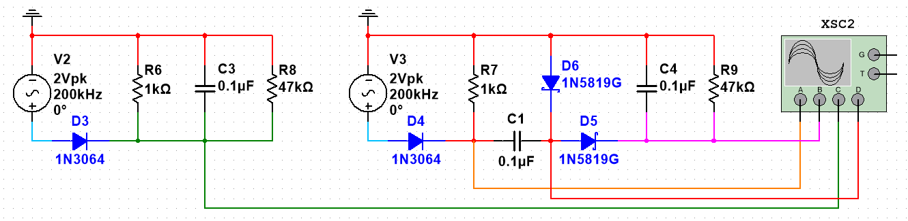

- 然后根据波形图，可以明显发现，加了电容和二极管后的输出是更加稳定的。所以还是很有必要添加的。特别是实际应用中不算稳定的正弦波输入。

### 3）基本放大器 + 整流滤波

- 最后，把`1）`和`2）`两部分结合起来，就是开源电路的设计了。再把一路拷贝四份组合就是一个完整的应用电路。

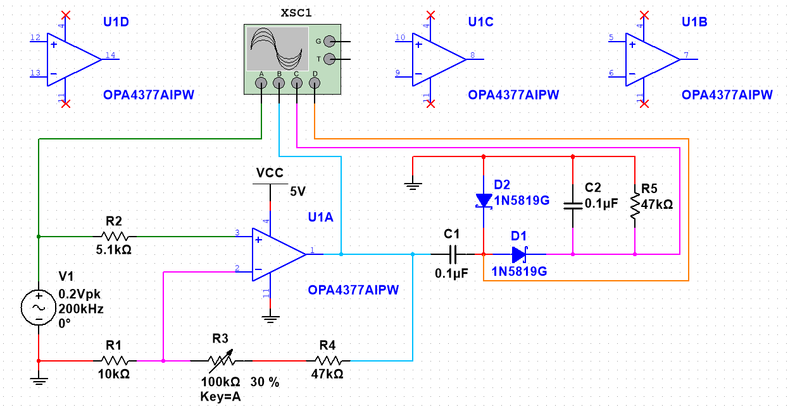

- 对比四点的波形图，加深理解。最后提醒一下注意事项，[运算放大器使用的六个经验](http://www.elecfans.com/analog/20161128452967.html)。

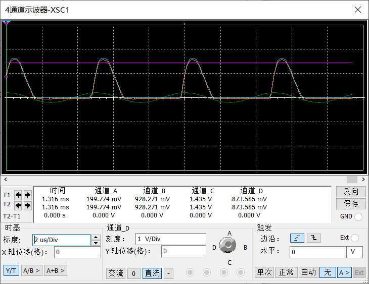

> 还有很多其他滤波电路方案，推荐各位自行尝试。这一篇笔记就到这里了,谢谢阅读。另外，波形图的曲线颜色我几乎一直在变，如果不细心点看的时候可能都找不到对应的线，实在不好意思。

#  四、推荐笔记

## 1） [OPA4377运放电路的工作原理](https://blog.csdn.net/Hui_1209/article/details/113722511)

