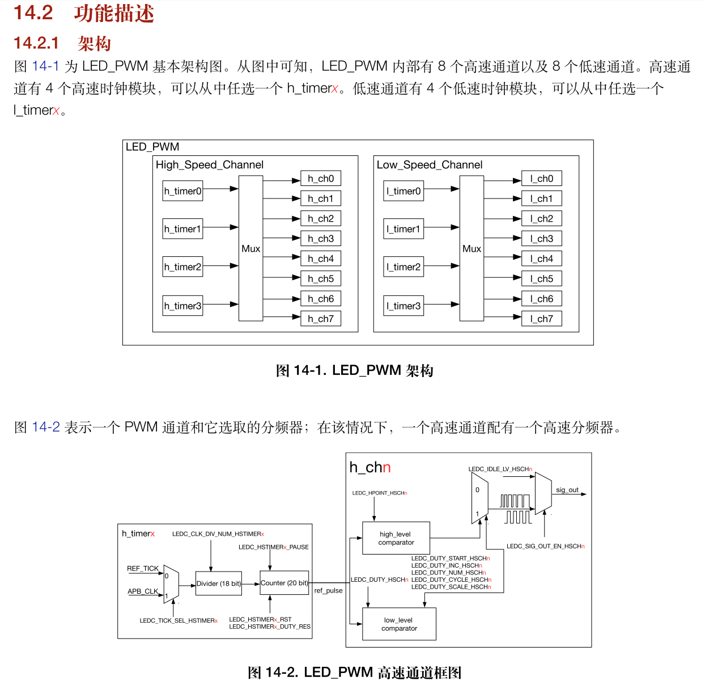
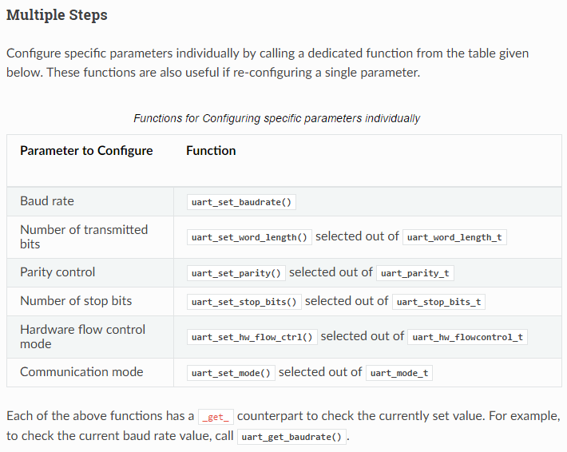

# ESP32 单片机学习笔记 - 01 - 例程学习

## 零、准备相关资料

- 教程笔记：[ESP32开发指南目录（开源一小步出品）](https://blog.csdn.net/qq_24550925/article/details/85933563)，这是由“*嘉友创科技*”发布在CSDN上的教程，我前期准备编译环境的时候也参考了，虽然没起到什么作用。不过后面的章节编写esp32例程的内容很完善，所以还是很推荐。感谢作者的总结整理。
- 官方指南：[ESP-IDF 编程指南](https://docs.espressif.com/projects/esp-idf/zh_CN/latest/esp32/index.html)，是官方编写的指南，内容很全，其实光看这个就可以了。但是因为内容有点跳跃性，我作为小白要完全看懂还是有点困难，要搭配教程笔记看比较好。在“*API参考*”里就是例程的讲解。
- 技术手册：[ESP32 H/W 硬件参考](https://docs.espressif.com/projects/esp-idf/zh_CN/latest/esp32/hw-reference/index.html)，光看软件程序不行，还要结合硬件一起思考理解才到位。同样是在官方指南里，分类属于“*ESP32 H/W 硬件参考*”，第一个“*ESP32 技术参考手册 (PDF)*”就是芯片的数据手册，描写了各种硬件资源、寄存器配置等。
- 官方例程：[github：esp-idf/examples/](https://github.com/espressif/esp-idf/tree/9d34a1cd42f6f63b3c699c3fe8ec7216dd56f36a/examples)，在esp-idf文件夹下或是vscode插件内也可以查看，这里放出git仓库里的连接。直接在网页查看还是挺方便的。`/peripherals`里主要就是要学习的外设，学单片机，先从外设入手。会用了，其他什么都好说。

- 至此准备好这4样资料，再加上已经弄好的编译环境，就可以开始学习esp32了。直接上代码例程，快速入门。我使用的vscode编写+cmd编译，vscode的插件一直没弄好，而且发现还是cmd更加好用一点。如果编译有错一样可以看错误内容和错误行数，也能检查错误，而且运行速度还很快。

> 注意事项：
> 1. 我发现esp32芯片的IO命名格式是IOx，而开发板上的明明就是Dx，是一一对应的。但是看了esp8266的教程时发现，教程里说esp8266模块的Dx不是和IOx一一对应的？！之后用时留意一下。

## 一、get-started/hello_world&key&led

> 官方例程：[github:esp-idf/examples/get-started/](https://github.com/espressif/esp-idf/tree/9d34a1cd42f6f63b3c699c3fe8ec7216dd56f36a/examples/get-started)
> 官方指南：没有专门列出来，一部分应该是属于刚测试板子能不能正常下载或编译的内容，所以没单独讲。
> 教程笔记：[第八章 ESP32驱动LED灯](https://blog.csdn.net/qq_24550925/article/details/85335412)

- 在示例文件`get-started`下，有2个最基本的IO控制和打印输出文件，再结合大佬的笔记：[ESP32开发 2.添加.c.h并修改CMakeLists，来定制自己的工程](https://blog.csdn.net/Mark_md/article/details/113884641)。先自己动手编写一个工程，实现串口打印，点亮led灯，还有读取按键。

- 普通以为的单片机类似，可以使用一个快捷初始化函数配置io口`gpio_pad_select_gpio`，然后再设置一下输入输出方向`gpio_set_direction`，还有高低电平`gpio_set_level`，或是读取电平`gpio_get_level`就可以了。串口打印就是`print`，因为没有本地库直接查看，所以也不知道链接到哪里了。初始化等工作好像已经预先做了一部分了。

```C#
    /* 快捷初始化 */
    gpio_pad_select_gpio(BLINK_GPIO);
    /* Set the GPIO as a push/pull output */
    gpio_set_direction(BLINK_GPIO, GPIO_MODE_OUTPUT);
    /* 设置电平 */
    gpio_set_level(BLINK_GPIO, 1);
    /* 读取电平 */
    esp_err_t flag_i = gpio_get_level(18);
```

- 简单的api函数还可以跳到头文件去`gpio.h`查看，读取电平函数就是这样找到的。初步探索成功，同时在工程`components`下展开自己的库，开始培养习惯，初步就是如此。

## 二、peripherals/gpio

> 官方例程：[github:esp-idf/examples/peripherals/gpio/](https://github.com/espressif/esp-idf/tree/9d34a1cd42f6f63b3c699c3fe8ec7216dd56f36a/examples/peripherals/gpio)。
> 官方指南：[GPIO & RTC GPIO](https://docs.espressif.com/projects/esp-idf/zh_CN/latest/esp32/api-reference/peripherals/gpio.html)，官方指南的这一章只有一小撮英文介绍，然后全是API介绍。
> 教程笔记：[第九章 ESP32的GPIO输入按键操作](https://blog.csdn.net/qq_24550925/article/details/85335516)，教程里并没有提到RTC，也没涉及到到*任务*和*队列*。

- 配置io方面，使用传统的结构体`gpio_config_t`+初始化`gpio_config`组合，可以打开声明查看更多的`枚举/宏定义`设置。同时也可以同时选择多个引脚，记得使用移位的方式转换，不是直接丢十进制。还有，常用的改变

```c#
#define GPIO_OUTPUT_IO_0    5
#define GPIO_OUTPUT_IO_1    19
#define GPIO_OUTPUT_PIN_SEL  ((1ULL<<GPIO_OUTPUT_IO_0) | (1ULL<<GPIO_OUTPUT_IO_1))

    gpio_config_t io_conf;
    //disable interrupt 禁止中断
    io_conf.intr_type = GPIO_PIN_INTR_DISABLE;
    //set as output mode 设置为输出模式
    io_conf.mode = GPIO_MODE_OUTPUT;
    //bit mask of the pins that you want to set,e.g.GPIO18/19 您想要设置的引脚的位掩码，例如gpio18 /19
    io_conf.pin_bit_mask = GPIO_OUTPUT_PIN_SEL;
    //disable pull-down mode 关闭下拉模式
    io_conf.pull_down_en = 0;
    //disable pull-up mode 禁用上拉模式
    io_conf.pull_up_en = 0;
    //configure GPIO with the given settings 使用给定的设置配置GPIO
    gpio_config(&io_conf);

    //change gpio intrrupt type for one pin 更改一个引脚的gpio中断类型
    gpio_set_intr_type(GPIO_INPUT_IO_0, GPIO_INTR_ANYEDGE);
```

- 有点注意的，不需要使能总线下的分时钟，esp只有一个系列的引脚。手册里全写的是GPIOx，不像其他单片机那么多引脚，还要加前缀区分。


- 再者，没想到第一个外设例程`peripherals/gpio`就那么复杂，用到了线程和信号量？类比最近刚学的`RT-Thread`系统，好像和esp内的`FreeRTOS`是类似的系统。（嘿嘿，之前学习的作用那么快体现了）

```C#
static xQueueHandle gpio_evt_queue = NULL;

static void IRAM_ATTR gpio_isr_handler(void* arg)
{
    uint32_t gpio_num = (uint32_t) arg;
    xQueueSendFromISR(gpio_evt_queue, &gpio_num, NULL);
}

static void gpio_task_example(void* arg)
{
    uint32_t io_num;
    for(;;) {
        if(xQueueReceive(gpio_evt_queue, &io_num, portMAX_DELAY)) {
            printf("GPIO[%d] intr, val: %d\n", io_num, gpio_get_level(io_num));
        }
    }
}

    //create a queue to handle gpio event from isr 创建一个队列来处理isr中的gpio事件
    gpio_evt_queue = xQueueCreate(10, sizeof(uint32_t));
    //start gpio task 开始gpio任务
    xTaskCreate(gpio_task_example, "gpio_task_example", 2048, NULL, 10, NULL);

    //install gpio isr service 安装gpio isr服务
    gpio_install_isr_service(ESP_INTR_FLAG_DEFAULT);
    //hook isr handler for specific gpio pin 钩子isr处理程序为特定的gpio引脚
    gpio_isr_handler_add(GPIO_INPUT_IO_0, gpio_isr_handler, (void*) GPIO_INPUT_IO_0);
    //hook isr handler for specific gpio pin 钩子isr处理程序为特定的gpio引脚
    gpio_isr_handler_add(GPIO_INPUT_IO_1, gpio_isr_handler, (void*) GPIO_INPUT_IO_1);

    //remove isr handler for gpio number. 删除gpio编号的isr处理程序。
    gpio_isr_handler_remove(GPIO_INPUT_IO_0);
    //hook isr handler for specific gpio pin again 再次挂钩特定gpio引脚的isr处理程序
    gpio_isr_handler_add(GPIO_INPUT_IO_0, gpio_isr_handler, (void*) GPIO_INPUT_IO_0);
```

1. 结合之前学的`RT-Thread`知识，知道`isr`函数就是指中断函数的意思。通过例程可得知，在使用中断功能前，还需要先**安装**`gpio_install_isr_service`，如果链接之后还可以删除，删除后也可以再链接。
2. 还有前一步的`xQueueCreate`**队列创建**API，创建了一个长度为10的队列，编写了当队列接收到信号时就执行对应的函数`gpio_task_example`，这个信号由中断函数中发出。使用`xTaskCreate`初始化该任务（函数）。看这个参数列表就感觉很亲切，和RTT系统类似。第一个盲猜是该任务的函数名，第二是该任务的名字，在rtt系统中一般称为线程，使用的英文也是`thread`。在`freertos`中则用`task`，中文意思是任务。这个大同小异，问题不大。第三个应该是指2048运行空间，第四个指任务函数的参数，是空。第五个是优先级或是时间片？第六个是运行模式设置？
3. `task`任务，有点注意的是函数设置的参数是`NULL`，然后函数里通过获取队列信息来得到参数。根据注释“*创建一个队列来处理isr中的gpio事件*”，应该是为了一种编程思维——程序不堆在中断中执行，所以才设立了额外的`task`任务。
4. 更多关于`task`任务的资料，可以上官方手册上找，没想到还是全英文的，我以为esp是国产的？[在api文档中搜索xTaskCreate](https://docs.espressif.com/projects/esp-idf/zh_CN/latest/esp32/api-reference/system/freertos.html?highlight=xtaskcreate#_CPPv411xTaskCreate14TaskFunction_tPCKcK8uint32_tPCv11UBaseType_tPC12TaskHandle_t)。


## 三、peripherals/ledc/

> 官方例程：[github:esp-idf/examples/peripherals/ledc/](https://github.com/espressif/esp-idf/tree/9d34a1cd42f6f63b3c699c3fe8ec7216dd56f36a/examples/peripherals/ledc)。
> 官方指南：[LED PWM 控制器](https://docs.espressif.com/projects/esp-idf/zh_CN/latest/esp32/api-reference/peripherals/ledc.html)，这一部官方指南就有很详细的介绍了，而且我还发现原来浏览器也适用快捷键"ALT+←/→"进行返回跳转，结合指南来查看api定义，某种长度上比ide还方便。
> 教程笔记：[第十章 ESP32开发指南---PWM全彩LED灯显示](https://blog.csdn.net/qq_24550925/article/details/85335629)。
> 数据手册：[ESP32 技术参考手册](https://www.espressif.com/sites/default/files/documentation/esp32_technical_reference_manual_cn.pdf)，在PDF的第十四章：*LED PWM 控制器 (LEDC)*。

- 先看官方指南，根据“*功能概览*”可知，第一步 *定时器配置* ；第二步 *通道配置* ； 第三步 *改变PWM信号* 。再对应例程代码，和每一步的介绍来看。

```C#
    ledc_timer_config_t ledc_timer = {              // 创建的同时直接指定值，记住该结构体的用法
        .duty_resolution = LEDC_TIMER_13_BIT,       // resolution of PWM duty PWM占空比分辨力
        .freq_hz = 5000,                            // frequency of PWM signal PWM信号频率
        .speed_mode = LEDC_HIGH_SPEED_MODE,         // timer mode 计时模式
        .timer_num = LEDC_TIMER_0,                  // timer index 计时器索引
        .clk_cfg = LEDC_AUTO_CLK,                   // Auto select the source clock 自动选择源时钟
    };
    // Set configuration of timer0 for high speed channels 设置高速通道的timer0配置
    ledc_timer_config(&ledc_timer);

    /*
     *   Note: if different channels use one timer, 注意:如果不同的通道使用一个定时器，
     *         then frequency and bit_num of these channels will be the same 那么这些通道的 频率 和 分辨率 将是相同的
     */
    ledc_channel_config_t ledc_channel = {
            .channel    = LEDC_CHANNEL_0,           // controller's channel number 选择定时器通道号
            .duty       = 0,                        // output duty cycle, set initially to 0 输出占空比，取值范围[0, (2**duty_resolution)]
            .gpio_num   = 5,                        // GPIO number where LED is connected to LED所连接的GPIO编号
            .speed_mode = LEDC_HIGH_SPEED_MODE,     // speed mode, either high or low 速度模式，高或低
            .hpoint     = 0,                        // LEDC channel hpoint value, the max value is 0xfffff LEDC通道点值，最大值为0xfffff
            .timer_sel  = LEDC_TIMER_0              // timer servicing selected channel 选择定时器(0-3)
        };
    ledc_channel_config(&ledc_channel);
    
    ledc_set_duty(                                  //使用软件改变 PWM 占空比
        ledc_channel.speed_mode,                    // 同下
        ledc_channel.channel, 
        4000);                                      // 注意，使用软件的话没有过渡时间的功能设置
    ledc_update_duty(   
        ledc_channel.speed_mode,                    // 同下
        ledc_channel.channel);
    
    ledc_fade_func_install(0);                      // Initialize fade service. 初始化 渐变 服务。
    ledc_set_fade_with_time(                        // 使用硬件改变 PWM 占空比
        ledc_channel.speed_mode,                    // 选择高低速
        ledc_channel.channel,                       // 选择通道数
        4000,                                       // 设置占空比
        3000);                                      // 设置过渡时间
    ledc_fade_start(                                // 使新配置生效
        ledc_channel.speed_mode,                    // 同上
        ledc_channel.channel, 
        LEDC_FADE_NO_WAIT);                         // Whether to block until fading done. 是否阻塞直到淡出。
```

- 以上就是三步走流程主要代码，依旧是`struct`+`config`就完事了。需要注意的几点：
- 1. 软件修改占空比没有过渡时间，属于直接修改。硬件修改占空比之前需要先调用`ledc_fade_func_install`。
- 2. 占空比取值范围和分辨率有关,然后分辨率又和频率有关。
- 3. `ledc_channel_config_t`结构体中，`hpoint`通道点数还不知道是什么作用。在*教程笔记*里是没有写出这个参数，大概是暂不用关心其作用吧。而例程中少写了一个`intr_type`中断使能参数。
- 4. 硬件的修改占空比，在`ledc_fade_start`生效函数中可以选择模式，例如：`LEDC_FADE_NO_WAIT`。

- 再结合硬件知识了解一下配置，可以`ledc_timer_bit_t`分辨率（1-20），`ledc_mode_t`计时模式（高或低），`ledc_timer_t`LEDC定时器（0-3），`ledc_channel_t`LEDC通道（0-7）。



- 更多操作：*改变PWM频率*，*控制 PWM 的更多方式*，*使用中断*，*高低速模式的区别*，这些可到用时再自行查手册。值得注意的是：*频率和占空比分辨率支持范围*，不同的分频/频率，对应不同的分辨率，计算公式一代入就可以了。类比玩智能车时，设置的频率、占空比、总占空比。当时的库应该是打包了计算，又因为没有超出范围，所以并没有在意分辨率这个参数。

## 四、peripherals/uart/

> 官方例程：[github:esp-idf/examples/peripherals/uart/](https://github.com/espressif/esp-idf/tree/9d34a1cd42f6f63b3c699c3fe8ec7216dd56f36a/examples/peripherals/uart)，官方例程给了很多个uart例程，官方指南也是全英文的，所以我先从教程笔记入手，先学习怎么用基本的功能。
> 官方指南：[UART](https://docs.espressif.com/projects/esp-idf/zh_CN/latest/esp32/api-reference/peripherals/uart.html)，又是全英文的一篇，呜呜。
> 教程笔记：[第十一章 ESP32的两个UART实验](https://blog.csdn.net/qq_24550925/article/details/85335709)，笔记里写的映射引脚和我板子不一样，各位在使用时也要注意一下，查看对应的手册查找。*避免怀疑自己*。
> 数据手册：[ESP32 技术参考手册](https://www.espressif.com/sites/default/files/documentation/esp32_technical_reference_manual_cn.pdf)，在PDF的第十三章：*UART 控制器 (UART)*。
> 模块手册：[ESP32­WROOM­32](https://www.espressif.com/sites/default/files/documentation/esp32-wroom-32_datasheet_cn.pdf)，其中有*2.2 管脚定义*记录了引出的引脚定义，可以看到开发板上引出来的`uart0`和`uart2`到底指哪个引脚。

- 首先，我想找到esp32模块的下载程序时用到的是哪个串口，按照之前的思维，我跳转到调用了主函数`app_main`的地方，找到了`esp32/cpu_start.c`，里面有2个cpu核心的`call_start_cpu0/1`函数。其中`call_start_cpu0`类比之前学过的RT-Tread系统，频率初始化、向量加载、然后开始特有的外部ram和flash初始化、之后一堆没怎么看懂的各种初始化。然后`call_start_cpu1`函数就简单多了，只有一些基本的初始化，其中`uart0`的初始化也在其中，跳转只能调到头文件，看不到具体内容，不过注释写着就是初始化uart0，看来是写死的函数。在文件的最后有`main_task`任务函数，里面调用了主函数`app_main`。

- 教程笔记里的例程内容是初始化uart1和uart2，再分别创建2个`task`任务函数，分别接收另一个串口的信息并发回去，主函数再分别发一次作为起始条件。总结：第一步：初始化；第二步：读或收就可以了。注意，在`config`配置好后，还需要进行两步操作：*IO映射*和*安装使能*。然后就可以正常读写了。

> 因为uart1是*连接模组上集成的 SPI flash*，所以我想改为uart0，但是串口又是系统的打印函数。而且不知道为什么没有预期实验效果……试官方例程是可以，应该是我哪里弄错了……或者不可以串联uart0和uart2？在官方例程的基础上改动和学习吧，教程笔记也可能有过期或是错误的。第二天，我又重新写了一遍配置函数又可以了……任务函数还没变，可能之前我哪里弄错了。我对比了一下配置函数，好像也是一样的。不过`uart0`打印还是有点问题，应该是接收的问题？“*L�&�+�This is a test string. - 4；This is a test string. - 4*”？？？

```C#
uart_config_t uart_config = {
    .baud_rate = 115200,
    .data_bits = UART_DATA_8_BITS,
    .parity = UART_PARITY_DISABLE,
    .stop_bits = UART_STOP_BITS_1,
    .flow_ctrl = UART_HW_FLOWCTRL_DISABLE,
    .rx_flow_ctrl_thresh = 122,
};
// Configure UART parameters
uart_param_config(uart_num, &uart_config);

// Set UART pins(TX: IO17 (UART2 default), RX: IO16 (UART2 default), RTS: IO18, CTS: IO19)
uart_set_pin(uart_num, tx_io, rx_io, UART_PIN_NO_CHANGE, UART_PIN_NO_CHANGE);

// Setup UART buffered IO with event queue 使用事件队列设置UART缓冲IO
const int uart_buffer_size = (512 * 2);
// QueueHandle_t uart_queue;
// Install UART driver using an event queue here 安装UART驱动程序，不需要事件队列
uart_driver_install(uart_num, uart_buffer_size, \
                        uart_buffer_size, 10, NULL, 0);

//串口0数据发送测试，参数分别是：串口号、数据指针、数据大小
uart_write_bytes(UART_NUM_0, "uart0 test OK ", strlen("uart0 test OK "));
//分配内存，用于串口接收
uint8_t* data = (uint8_t*) malloc(1024+1);     
//获取串口1接收的数据，返回的是接收多少个字节，如果是0就是超时了。最后一个参数也就是超时时间/等待时间
const int rxBytes = uart_read_bytes(UART_NUM_0, data, 1024, 10 / portTICK_RATE_MS);
```

### 1) UART Overview

- 接下来介绍[官方指南](https://docs.espressif.com/projects/esp-idf/zh_CN/latest/esp32/api-reference/peripherals/uart.html)的介绍：深入了解`esp32/uart`的使用方法。

- 指南总结使用uart的六个步骤，其中三个是必须的配置阶段：1.*设置通信参数-设置波特率、数据位、停止位等。*；2.*设置通信引脚—为设备分配连接引脚。*；3.*驱动安装—为UART驱动分配ESP32的资源。*。第四个是运行阶段：*运行UART通信-发送/接收数据*。第五六属于可选的：*使用中断——触发特定通信事件的中断*、*删除驱动程序——如果不再需要UART通信，则释放已分配的资源*。另外，值得注意的是每个函数都会有`uart_port_t`参数，用来指定串口号，选择范围是（0、1、2）。

- 1. 第一步：设置通信参数，指南提出两中方案，一种是一步到位的全部配置。也就是上面代码的例子，使用`struct`+`config`一步到位。第二种就是分步式，因为`esp-idf`提供了很多单独`set`设置的API，还每个对应的有一个`get`读取API可调用。如下图所示：



- 2. 第二步：设置通信引脚，调用`uart_set_pin`函数填充对应函数即可，这一不的功能就有点想引脚初始化或是引脚复用，因为uart模块可能支持多个引脚的复用，那我们就需要选定使用哪个引脚。同时，它本身也有默认配置，如果不想修改为自己指定的引脚（比如用不到的引脚就懒得管它了），那可以填充`UART_PIN_NO_CHANGE`作为替换。上面代码里也有出现对应的操作，对于`RTS`引脚和`CTS`引脚的选定参数保持默认，而指南里是对`RX`和`TX`引脚保持默认。另外需要注意，指南里还使用到了`ESP_ERROR_CHECK`宏定义来嵌套调用函数，应该是起到一个检查参数的作用。

> 小插曲，我以为uart2的默认引脚是`IO17`和`IO16`，就使用了`UART_PIN_NO_CHANGE`代替，官方指南也是这么写的。没想到死活接收不到发送出来的信息，然后我以为是配置不对，就把串口号改为`uart0`，通过使用默认引脚，这又可以发送内容，所以就排除了是配置过程出现问题。再者就是测试硬件是否连通，用万用表测得`tx2`和`rx2`也都是接到模块的`io17`和`io16`上的。最后，我尝试不使用默认参数，而是指定`io17`和`io16`结果就成功了。所以我得出：esp32的`uart2`默认引脚不是`io17`和`io16`，但是这又和指南和手册的说明矛盾了……

- 3. 第三步：驱动程序安装，一旦设置了通信引脚，通过调用`uart_driver_install()`安装驱动程序，并指定以下参数:*Tx环形缓冲区的大小*、*Rx环形缓冲区的大小*、*事件队列句柄和大小*、*标记来分配中断*。该函数将为UART驱动程序分配所需的内部资源。完成此步骤后，就可以连接外部UART设备并检查通信。（官方指南的翻译，写的很明确）

```C#
// Setup UART buffered IO with event queue 使用事件队列设置UART缓冲IO
const int uart_buffer_size = (1024 * 2);
// 这一步还不太能理解，先放一放，看到后面自然明白。
QueueHandle_t uart_queue;       
// Install UART driver using an event queue here 使用事件队列安装UART驱动程序
ESP_ERROR_CHECK(uart_driver_install(UART_NUM_2, uart_buffer_size, \
                                        uart_buffer_size, 10, &uart_queue, 0));
```

> 个人理解`uart_driver_install`中的`uart_queue`参数，在官方指南的[API说明](https://docs.espressif.com/projects/esp-idf/zh_CN/latest/esp32/api-reference/peripherals/uart.html#_CPPv419uart_driver_install11uart_port_tiiiP13QueueHandle_ti)中是这样介绍的：*UART事件队列句柄(输出参数)。如果成功，将在这里写入一个新的队列句柄，以提供对UART事件的访问。如果设置为NULL，驱动程序将不使用事件队列*。再结合前面学习`gpio`时也用到了`QueueHandle`队列句柄，再翻看之前的gpio的例程中使用的是`static xQueueHandle gpio_evt_queue = NULL;`而uart例程使用的`static QueueHandle_t uart0_queue;`，其中通过跳转可以发现`xQueueHandle`是`QueueHandle_t`的一个打包宏定义（别名），~~不知道为什么要定义那么多个重名……~~ 再结合应用场景，很“理所当然/自然”的就明白了：如果配置了这个参数，~~当串口接收或发送~~（后来结合例程实践得知，当串口每次状态变化都会触发一次，不只是接收和发送）信息时就会产生一个队列信号，再用`xQueueReceive`函数获取。这样就可以代替中断功能了（？）。（学了rtos操作系统后）比起中断，我也更加喜欢用线程+队列来运行。

### 2) peripherals/uart/uart_events/

- 官方例程：[esp-idf/examples/peripherals/uart/uart_events/](https://github.com/espressif/esp-idf/tree/9d34a1cd42f6f63b3c699c3fe8ec7216dd56f36a/examples/peripherals/uart/uart_events)，官方有很多个例程，我先从这个开始讲起。

> 经过测试，发现该例程的功能是接收串口数据，以特定数量的连续帧尾结束。如果这次接收的数据中不包含帧尾则普通输出，如果包涵就会直接截断，剩下的数据会作为第二次读取的内容。（一开始惯性思维，一直以为是帧头，一直没弄清试验规律）

- 实验现象相当有趣，因为我很好奇，串口是怎么判断接收的数据中包含特定帧尾的。如果要监测应该是已经接收过一次才对，但是根据例程中，在`uart_driver_install`安装UART驱动程序时，指定的`uart0_queue`队列，在`uart_event_task`任务中，~~（这3句话连在一起可能有点绕）~~ 是先监测到了队列内容，队列内的数据是**结构体**（巧妙的用法，越发感觉到对象用法的样子）。结构体内的`type`属性就已经指明了接收了什么数据。

- 如果数据中包含帧尾就会返回`UART_PATTERN_DET`标志，如果是普通数据就返回`UART_DATA`标志。判断了标志才进行读取串口内容的。而且如果包含帧尾就会只读取到帧尾，剩下的数据就会保留到下次，还能继续触发队列返回。`FreeRTOS`系统真的是奇妙！

- 以下来总结一下程序流程：
- 1. 第一阶段：1）配置UART驱动程序参数； 2）安装UART驱动程序 和 队列； 3）设置UART引脚；
- 2. 第二阶段：1）设置uart模式检测函数； 2）设置检测标志的最大长度（好像不是数据的长度，而是帧尾的长度，那在上一步应该就设置好了才对，所以这一步是保护措施？）；
- 3. 第三阶段：1）创建任务来处理队列内容；2）编写任务的内容，读取队列，检查`event.type`，根据要求打印对应内容。
- 4. 额外操作：这个例程里还用到了`esp_log_level_set`日志设置和`ESP_LOGI`日志打印，根据实验现象，感觉和`printf`打印类似，不同的是打印的内容会有前缀后缀包裹，如果是用终端接收，这些前缀后缀就代表了显示的颜色，如果是用其他铺铜串口助手接收，那会显示未知字符。这应该不算必要项，只是看看

```C#
    /* Configure parameters of an UART driver, 配置UART驱动程序参数，
     * communication pins and install the driver 通信引脚和安装驱动程序 */
    uart_config_t uart_config = {
        .baud_rate = 115200,
        .data_bits = UART_DATA_8_BITS,
        .parity = UART_PARITY_DISABLE,
        .stop_bits = UART_STOP_BITS_1,
        .flow_ctrl = UART_HW_FLOWCTRL_DISABLE,
        .source_clk = UART_SCLK_APB,
    };
    uart_param_config(EX_UART_NUM, &uart_config);
    //Install UART driver, and get the queue. 安装UART驱动程序，获取队列。
    uart_driver_install(EX_UART_NUM, BUF_SIZE * 2, BUF_SIZE * 2, 20, &uart0_queue, 0);

    //Set UART log level 设置UART日志级别
    esp_log_level_set(TAG, ESP_LOG_INFO);
    //Set UART pins (using UART0 default pins ie no changes.) 设置UART引脚(使用UART0默认引脚，即没有改变)
    uart_set_pin(EX_UART_NUM, UART_PIN_NO_CHANGE, UART_PIN_NO_CHANGE, UART_PIN_NO_CHANGE, UART_PIN_NO_CHANGE);

    //Set uart pattern detect function. 设置uart模式检测函数。
    uart_enable_pattern_det_baud_intr(EX_UART_NUM, '+', PATTERN_CHR_NUM, 9, 0, 0);
    //Reset the pattern queue length to record at most 20 pattern positions. 将图案队列长度重置为最多记录20个图案位置。
    uart_pattern_queue_reset(EX_UART_NUM, 20);

    //Create a task to handler UART event from ISR 创建一个任务来处理来自ISR的UART事件
    xTaskCreate(uart_event_task, "uart_event_task", 2048, NULL, 12, NULL);
    
static void uart_event_task(void *pvParameters)
{
    /* 省略 */
    if(xQueueReceive(uart0_queue, (void * )&event, (portTickType)portMAX_DELAY)) 
        switch(event.type)
        { /* 根据不同标志做出内容 */}
    /* 省略 */
}
```

- 例程里还有几个触发事件类型没试验出现象，所以我也不太清楚具体是什么时候用的，之后遇到在回过头看吧。它们分别是：`UART_FIFO_OVF`,`UART_BUFFER_FULL`,`UART_BREAK`,`UART_PARITY_ERR`,`UART_FRAME_ERR`。感觉这种形式有点想python中的`typ`检错。

> 额外试验：测了一下，`uart_read_bytes`读取函数的`rxBytes`返回值的值代表接收到的数据长度。在教程中，如果要发送原数据，还需要手动在最后加一个*结束符*，这个结束符是`0`。好奇为什么不是`\0`？或是其他值，为了确保用`rxBytes`来指定结尾处。应该也是为了怕初始化内存里的值是未知数，所以要手动赋值0，以防万一。

- 看了一下`uart_async_rxtxtasks`和`uart_select`例程内的试验简介，感觉大同小异。这里为了赶进度和篇幅就暂时跳过，之后要用到了再回来看。

