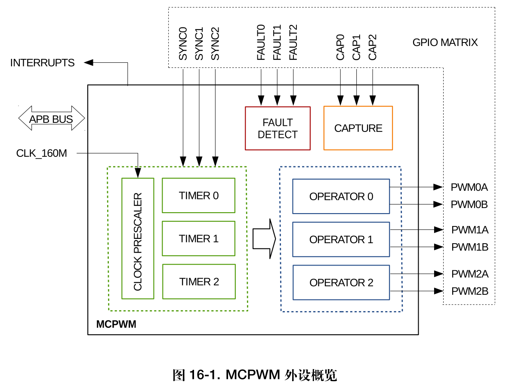
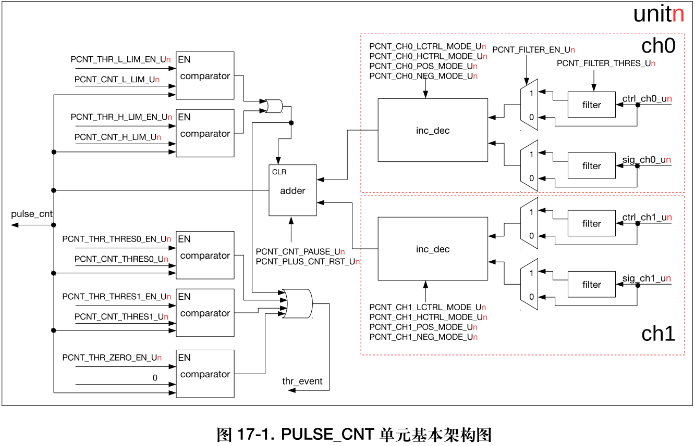

# ESP32 单片机学习笔记 - 03 - 例程学习

> 前言，继续上一篇的内容。因为上一篇刚好实验了iic和spi，形成一对。接下来讲pwm另起一篇。

## 一、电机PWM输出 - MCPWM

> 官方例程： [esp-idf/examples/peripherals/mcpwm/mcpwm_basic_config/](https://github.com/espressif/esp-idf/tree/master/examples/peripherals/mcpwm/mcpwm_basic_config)，官方有4个例程，我先看了这个，这个例程对 `mcpwm`模块的所有功能的配置过程和使用方法 都有举例。开始就结合这个例程和编程指南一起看。
> 官方指南： [MCPWM](https://docs.espressif.com/projects/esp-idf/zh_CN/latest/esp32/api-reference/peripherals/mcpwm.html)，虽然这次也是全英文的，不过感觉搭配例程来看还是很清晰的。
> 数据手册： [ESP32 技术参考手册 (PDF)](https://www.espressif.com/sites/default/files/documentation/esp32_technical_reference_manual_cn.pdf#mcpwm)，第十六章的：*电机控制脉宽调制器 (PWM)*。


- 首先，结合下图“ *MCPWM 外设概览*”介绍一下要用到的术语名词：(手册写的很简洁：*每个 MCPWM 外设都有一个时钟分频器（预分频器），三个 PWM 定时器，三个 PWM 操作器和一个捕获模块。*)
- 1. 首先，整个模块和 `APB BUS` 总线挂钩，时钟信号由 `CLK_106M` 输入到 `clock prescaler` 时钟预分频器。
- 2. `MCPWM` 有3个`TIMER x` 定时器模块(0-2)，可以外部输入3个 `SYNC x` 同步信号(0-2)，可以给3个 `OPERATOR x` 操作器模块(0-2)使用，使其生成2路 `PWM x A/B` 脉冲信号。
- 3. 还有 `FAULT DETECT` 故障检测 模块，可以外部输入3个 `FAULT x` 触发(0-2)引脚，来触发故障。同理还有 `CAPTURE` 捕获 模块，可外部输入 `CAP x` 信号(0-2)，模块可捕获其脉冲持续时间。
- 4. 最后，大部分功能都可以链接 `INTERRUPTS` 中断 使用。

> 吐槽一下命名：`TIMER x` PWM定时器模块 和 `OPERATOR x` PWM操作器模块。具体功能在技术手册有详细介绍。两者功能组合配置pwm的功能。
> 另一个好奇就是，我没看到引脚定义里有专门标着pwm的引脚，加上例程中的宏定义明明。这个pwm输出引脚莫非是可以链接到任意引脚的？好方便啊。



### 1) 引脚初始化 gpio_init

- 第一步，要先初始化所有引脚，可选择使用单独设置函数，一个个设置，也可以调用结构体一次性初始化所有引脚。其中，外部输入信号的引脚（`CAP`、`SYNC`、`FAULT`）还需要调用函数使能。
- ESP32中好像有2个 `MCPWM` 单元，也就是每个单元都有上图中全部的东西。又因为“*通过配置，任一 PWM 操作器可以使用任一 PWM 定时器的定时参考。*”（技术手册写的），不过，“*为了简化API，每个Timer被API自动关联，以驱动同一个索引的Operator，例如Timer 0与Operator 0关联。*”（编程指南写的）。所以调用esp-idf的api时，不需要再把定时器和操作器放开选择，api已经一一对应选择上了。我们只需要选择哪个`MCPWM`单元，和哪个`MCPWM`定时器模块就好了。

```C#
static void mcpwm_example_gpio_initialize(void)
{
    printf("initializing mcpwm gpio...\n");
#if MCPWM_GPIO_INIT   // 选择使用哪个函数来初始化gpio信号
    mcpwm_gpio_init(MCPWM_UNIT_0, MCPWM0A, GPIO_PWM0A_OUT); // 该函数初始化MCPWM的每个gpio信号。
    mcpwm_gpio_init(MCPWM_UNIT_0, MCPWM0B, GPIO_PWM0B_OUT); // 这个函数每次初始化一个gpio。
    mcpwm_gpio_init(MCPWM_UNIT_0, MCPWM1A, GPIO_PWM1A_OUT); // mcpwm_num:设置MCPWM单元(0-1)
    mcpwm_gpio_init(MCPWM_UNIT_0, MCPWM1B, GPIO_PWM1B_OUT); // io_signal:设置MCPWM信号，每个MCPWM单元有6个输出(MCPWMXA, MCPWMXB)和9个输入(SYNC_X, FAULT_X, CAP_X)其中X是timer_num(0-2)
    mcpwm_gpio_init(MCPWM_UNIT_0, MCPWM2A, GPIO_PWM2A_OUT); // gpio_num:设置为MCPWM配置gpio，如果你想使用gpio16, gpio_num = 16
    mcpwm_gpio_init(MCPWM_UNIT_0, MCPWM2B, GPIO_PWM2B_OUT);
    mcpwm_gpio_init(MCPWM_UNIT_0, MCPWM_CAP_0, GPIO_CAP0_IN); // 总结： mcpwm_gpio_init 函数可用来初始化当个引脚的pwm，简易快速的指定 MCPWM单元(0/1) 和 输出模块(A/B)，还有引脚。
    mcpwm_gpio_init(MCPWM_UNIT_0, MCPWM_CAP_1, GPIO_CAP1_IN);
    mcpwm_gpio_init(MCPWM_UNIT_0, MCPWM_CAP_2, GPIO_CAP2_IN);
    mcpwm_gpio_init(MCPWM_UNIT_0, MCPWM_SYNC_0, GPIO_SYNC0_IN);
    mcpwm_gpio_init(MCPWM_UNIT_0, MCPWM_SYNC_1, GPIO_SYNC1_IN);
    mcpwm_gpio_init(MCPWM_UNIT_0, MCPWM_SYNC_2, GPIO_SYNC2_IN);
    mcpwm_gpio_init(MCPWM_UNIT_0, MCPWM_FAULT_0, GPIO_FAULT0_IN);
    mcpwm_gpio_init(MCPWM_UNIT_0, MCPWM_FAULT_1, GPIO_FAULT1_IN);
    mcpwm_gpio_init(MCPWM_UNIT_0, MCPWM_FAULT_2, GPIO_FAULT2_IN);
#else
    mcpwm_pin_config_t pin_config = {
        .mcpwm0a_out_num = GPIO_PWM0A_OUT,   // 使用结构体快速一次性指定多个引脚，然后使用初始化函数一次完成。
        .mcpwm0b_out_num = GPIO_PWM0B_OUT,  
        .mcpwm1a_out_num = GPIO_PWM1A_OUT,   // 惊奇的发现，如果跳转过去看的话，其实 mcpwm_set_pin() 函数里就是调用了一堆 单独设置函数 ……
        .mcpwm1b_out_num = GPIO_PWM1B_OUT,
        .mcpwm2a_out_num = GPIO_PWM2A_OUT,
        .mcpwm2b_out_num = GPIO_PWM2B_OUT,
        .mcpwm_sync0_in_num  = GPIO_SYNC0_IN,
        .mcpwm_sync1_in_num  = GPIO_SYNC1_IN,
        .mcpwm_sync2_in_num  = GPIO_SYNC2_IN,
        .mcpwm_fault0_in_num = GPIO_FAULT0_IN,
        .mcpwm_fault1_in_num = GPIO_FAULT1_IN,  // 如果有不使用的引脚，要配置 -1 。（或者直接不写也可以，如果是负值会被忽略，如果不填应该就是指 IO0 了？？？）
        .mcpwm_fault2_in_num = GPIO_FAULT2_IN,  // 毕竟 mcpwm_set_pin 源函数是很简单粗暴的调用了 mcpwm_gpio_init 来初始化
        .mcpwm_cap0_in_num   = GPIO_CAP0_IN,
        .mcpwm_cap1_in_num   = GPIO_CAP1_IN,
        .mcpwm_cap2_in_num   = GPIO_CAP2_IN
    };
    mcpwm_set_pin(MCPWM_UNIT_0, &pin_config); // 设置MCPWM单元(0 - 1) MCPWM销结构
#endif
	// 使能下拉CAP0信号
    gpio_pulldown_en(GPIO_CAP0_IN);    //Enable pull down on CAP0   signal
    gpio_pulldown_en(GPIO_CAP1_IN);    //Enable pull down on CAP1   signal
    gpio_pulldown_en(GPIO_CAP2_IN);    //Enable pull down on CAP2   signal
    gpio_pulldown_en(GPIO_SYNC0_IN);   //Enable pull down on SYNC0  signal
    gpio_pulldown_en(GPIO_SYNC1_IN);   //Enable pull down on SYNC1  signal
    gpio_pulldown_en(GPIO_SYNC2_IN);   //Enable pull down on SYNC2  signal
    gpio_pulldown_en(GPIO_FAULT0_IN);  //Enable pull down on FAULT0 signal
    gpio_pulldown_en(GPIO_FAULT1_IN);  //Enable pull down on FAULT1 signal
    gpio_pulldown_en(GPIO_FAULT2_IN);  //Enable pull down on FAULT2 signal
}
```

### 2） 配置模块 config

- 1. `mcpwm` 配置，最基本的pwm输出（这一部分的参数配置也有一条条单独的配置函数可以调用，就不一一列举了，大概套路就是`set`+`name`结构体变量名。下面的其他配置的类似）

```C#
// mcpwm_config_t 结构中 设置定时器频率和初始占空比。
mcpwm_config_t pwm_config;
pwm_config.frequency = 1000;    //frequency = 1000Hz 1000赫兹频率(看样子，每个pwm定时器可以设置不同的频率，而其下的2个通道是要同频率的)
pwm_config.cmpr_a = 60.0;       //duty cycle of PWMxA = 60.0% PWMxA占空比= 60.0%
pwm_config.cmpr_b = 50.0;       //duty cycle of PWMxb = 50.0% 可以同时设置2个通道的占空比
pwm_config.counter_mode = MCPWM_UP_COUNTER; // 设置MCPWM计数器类型，
                                //对于不对称MCPWM 或 
                                //对于对称式MCPWM，频率为MCPWM设置频率的一半
pwm_config.duty_mode = MCPWM_DUTY_MODE_0;  // 设定占空比类型 （说人话就是占空比代表的是高电平还是低电平）
                                // 有源高占空比，即占空比与非对称MCPWM的高时间成正比 或 
                                // 有源低占空比，即占空比与非对称MCPWM的低时间成正比，反相(倒)MCPWM
mcpwm_init(MCPWM_UNIT_0, MCPWM_TIMER_0, &pwm_config);   //Configure PWM0A & PWM0B with above settings
                                // 使用以上设置配置PWM0A和PWM0B
```

- 2. `carrier configuration` 设置高频载波参数，我也不清楚这个功能有什么用，以前没接触过。之后用到了再补，先放出配置流程。

```C#
//in carrier mode very high frequency carrier signal is generated at mcpwm high level signal
// 在载波模式下，MCPWM高电平信号产生非常高频的载波信号 
mcpwm_carrier_config_t chop_config;
chop_config.carrier_period = 6;         //carrier period = (6 + 1)*800ns 载波周期 
chop_config.carrier_duty = 3;           //carrier duty = (3)*12.5% 重负荷载体 
chop_config.carrier_os_mode = MCPWM_ONESHOT_MODE_EN; //If one shot mode is enabled then set pulse width, if disabled no need to set pulse width
                                        // 如果开启了一次拍摄模式，请设置脉冲宽度，如果关闭了，则无需设置脉冲宽度    
chop_config.pulse_width_in_os = 3;      //first pulse width = (3 + 1)*carrier_period
                                        // 第一脉冲宽度=(3 + 1)*载波周期
chop_config.carrier_ivt_mode = MCPWM_CARRIER_OUT_IVT_EN; //output signal inversion enable 输出信号反转
mcpwm_carrier_init(MCPWM_UNIT_0, MCPWM_TIMER_2, &chop_config);  //Enable carrier on PWM2A and PWM2B with above settings
                                        // 在PWM2A和PWM2B上使用上述设置使能运营商
//use mcpwm_carrier_disable function to disable carrier on mcpwm timer on which it was enabled.
// 使用 mcpwm_carrier_disable 功能去使能MCPWM定时器的载波
```

- 3. `deadtime configuration` 死区时间配置，以前实现过软件死区（不知道是不是同一个概念）。我比较少用。

```C#
//add rising edge delay or falling edge delay. There are 8 different types, each explained in mcpwm_deadtime_type_t in mcpwm.h
// 增加上升沿延迟或下降沿延迟。有8种不同的类型，每种类型在mcpwm.h中的mcpwm_deadtime_type_t中解释

// 在PWM2A和PWM2B上启用死时间，红色= (1000)*100ns
mcpwm_deadtime_enable(MCPWM_UNIT_0, MCPWM_TIMER_2, MCPWM_BYPASS_FED, 1000, 1000);   //Enable deadtime on PWM2A and PWM2B with red = (1000)*100ns on PWM2A
// 在PWM1B上使用fed = (2000)*100ns使死时间
mcpwm_deadtime_enable(MCPWM_UNIT_0, MCPWM_TIMER_1, MCPWM_BYPASS_RED, 300, 2000);        //Enable deadtime on PWM1A and PWM1B with fed = (2000)*100ns on PWM1B
// 启用死时间PWM0A和PWM0B与红色= (656)*100ns &馈电= (67)*100ns对PWM0A和PWM0B从PWM0A产生
mcpwm_deadtime_enable(MCPWM_UNIT_0, MCPWM_TIMER_0, MCPWM_ACTIVE_RED_FED_FROM_PWMXA, 656, 67);  //Enable deadtime on PWM0A and PWM0B with red = (656)*100ns & fed = (67)*100ns on PWM0A and PWM0B generated from PWM0A
//use mcpwm_deadtime_disable function to disable deadtime on mcpwm timer on which it was enabled
//使用 mcpwm_deadtime_disable 功能关闭MCPWM定时器的死时间
```

- 4. enable `fault condition` 使能故障条件，个人理解，感觉像是硬件实现了外部中断使能pwm，起到保护作用。以往这一步是人为再软件层面判断实现的。之后可能会用到，因为不用再额外软件实现保护措施了。
- 

```C#
// 当故障发生时，你可以配置MCPWM信号强制低电平，强制高电平或切换。
//whenever fault occurs you can configure mcpwm signal to either force low, force high or toggle.
// 在循环模式下，一旦故障状态结束，MCPWM信号就会恢复，而在一次性模式下，你需要重置。
//in cycmode, as soon as fault condition is over, the mcpwm signal is resumed, whereas in oneshot mode you need to reset.
// 当FAULT0信号出现高电平时，使能FAULT
mcpwm_fault_init(MCPWM_UNIT_0, MCPWM_HIGH_LEVEL_TGR, MCPWM_SELECT_F0); //Enable FAULT, when high level occurs on FAULT0 signal
mcpwm_fault_init(MCPWM_UNIT_0, MCPWM_HIGH_LEVEL_TGR, MCPWM_SELECT_F1); //Enable FAULT, when high level occurs on FAULT1 signal
mcpwm_fault_init(MCPWM_UNIT_0, MCPWM_HIGH_LEVEL_TGR, MCPWM_SELECT_F2); //Enable FAULT, when high level occurs on FAULT2 signal
// 发生FAULT0故障时，PWM1A和PWM1B的处理方法
mcpwm_fault_set_oneshot_mode(MCPWM_UNIT_0, MCPWM_TIMER_1, MCPWM_SELECT_F0, MCPWM_FORCE_MCPWMXA_HIGH, MCPWM_FORCE_MCPWMXB_LOW); //Action taken on PWM1A and PWM1B, when FAULT0 occurs
mcpwm_fault_set_oneshot_mode(MCPWM_UNIT_0, MCPWM_TIMER_1, MCPWM_SELECT_F1, MCPWM_FORCE_MCPWMXA_LOW, MCPWM_FORCE_MCPWMXB_HIGH); //Action taken on PWM1A and PWM1B, when FAULT1 occurs
mcpwm_fault_set_oneshot_mode(MCPWM_UNIT_0, MCPWM_TIMER_0, MCPWM_SELECT_F2, MCPWM_FORCE_MCPWMXA_HIGH, MCPWM_FORCE_MCPWMXB_LOW); //Action taken on PWM0A and PWM0B, when FAULT2 occurs
mcpwm_fault_set_oneshot_mode(MCPWM_UNIT_0, MCPWM_TIMER_0, MCPWM_SELECT_F1, MCPWM_FORCE_MCPWMXA_LOW, MCPWM_FORCE_MCPWMXB_HIGH); //Action taken on PWM0A and PWM0B, when FAULT1 occurs
// 通过例程可以推测，不同模块是可以连接到同一个错误信号中的，MCPWM_TIMER_1 和 MCPWM_TIMER_0 都有链接到 MCPWM_SELECT_F1 的输入。不过应该要处于统一单元才可以。
```

- 5. `Syncronization configuration` 同步 配置，手册没有专门来讲述怎么配置。是嵌套在讨论怎么控制电机里讨论（还是注解的部分）。好像使用起来也挺方便的，直接设定和同步源（引脚输入）的相位值就可以了。

```C#
// 在PWM1A和PWM1B上同步
//here synchronization occurs on PWM1A and PWM1B
// 当同步0发生时，mcpwm定时器1的周期计数器的20%的负载计数器值
mcpwm_sync_enable(MCPWM_UNIT_0, MCPWM_TIMER_1, MCPWM_SELECT_SYNC0, 200);    //Load counter value with 20% of period counter of mcpwm timer 1 when sync 0 occurs
```

- 6. `Capture configuration`  捕获 配置，好像不是捕获脉冲计数的，而是捕获脉冲持续时间的。在例程里还写了一个软件拉高拉低引脚的函数，和一个读取捕获中断打印捕获的持续时间的函数，供测试使用。

> 看了一下介绍，是可以用来捕获霍尔传感器？（和原本的理解霍尔编码器不一样）因为没接触过所以先跳过。 （看来我对“霍尔”一词还很抽象，查查资料感觉眼前一亮：[快速扫盲 | 霍尔传感器的工作原理](https://blog.csdn.net/u010632165/article/details/116024682)）

```C#
// 配置CAP0, CAP1和CAP2信号启动上升沿捕获计数器
//configure CAP0, CAP1 and CAP2 signal to start capture counter on rising edge
// 我们在GPIO 12上生成一个20ms的gpio_test_signal，并将其连接到捕获信号之一，disp_captured_function显示上升边缘之间的时间
//we generate a gpio_test_signal of 20ms on GPIO 12 and connect it to one of the capture signal, the disp_captured_function displays the time between rising edge
// 一般情况下，您可以将Capture连接到外部信号，测量上升沿或下降沿之间的时间，并采取相应的行动
//In general practice you can connect Capture  to external signal, measure time between rising edge or falling edge and take action accordingly
// 捕获信号上升边缘，前标度= 0即800000000计数等于1秒
mcpwm_capture_enable(MCPWM_UNIT_0, MCPWM_SELECT_CAP0, MCPWM_POS_EDGE, 0);  //capture signal on rising edge, prescale = 0 i.e. 800,000,000 counts is equal to one second
mcpwm_capture_enable(MCPWM_UNIT_0, MCPWM_SELECT_CAP2, MCPWM_POS_EDGE, 0);  //capture signal on rising edge, prescale = 0 i.e. 800,000,000 counts is equal to one second
mcpwm_capture_enable(MCPWM_UNIT_0, MCPWM_SELECT_CAP1, MCPWM_POS_EDGE, 0);  //capture signal on rising edge, prescale = 0 i.e. 800,000,000 counts is equal to one second
// 启用中断，这样每一个上升边发生中断就会被触发
//enable interrupt, so each this a rising edge occurs interrupt is triggered
// 对CAP0、CAP1和CAP2信号使能中断
MCPWM[MCPWM_UNIT_0]->int_ena.val = CAP0_INT_EN | CAP1_INT_EN | CAP2_INT_EN;  //Enable interrupt on  CAP0, CAP1 and CAP2 signal
mcpwm_isr_register(MCPWM_UNIT_0, isr_handler, NULL, ESP_INTR_FLAG_IRAM, NULL);  //Set ISR Handler 设置ISR处理程序
```

- 以上就是`mcpwm_basic_config_example`例程的主要内容了。主要用到的，应该是`gpio初始化`、`pwm初始化`，如果需要可能会尝试`故障检测`、`同步信号`，或是`死区时间`。再翻翻其他例程。
- 翻完了，总结：`mcpwm_basic_config_example`是总配置例程，使用了所有模块的功能；`mcpwm_bldc_control_hall_sensor_example`是[无刷电机](https://docs.espressif.com/projects/esp-idf/zh_CN/latest/esp32/api-reference/peripherals/mcpwm.html#capture)的例程，使用了pwm和capture的功能； `mcpwm_brushed_dc_control_example`是直流电机的例程，简单的正反转加停止的pwm功能；`mcpwm_servo_control_example`是伺服电机的例程，也只使用了单纯的pwm功能，不过其中加了一个计算脉冲和角度之间关系的函数。以上就是4个例程的内容了。

> 在直流电机的例程中，可以从思路上看出来，模块设置AB通道，就是为了给一个电机正反转用的。如果是只需要单脉冲+方向的驱动。那可以少初始化一个端口了吧（？）


### 3）PWM控制

- 最后补充，配置了那么多，最重要还是要怎么用pwm，esp32的api提供了功能给我们调用？(以下是编程指南的翻译)
- 1. 我们可以使用函数`mcpwm_set_signal_high()`或`mcpwm_set_signal_low()`来驱动特定的信号稳定高或稳定低。这将使电机以最高速度转动或停止。根据选择的输出A或B，电机将旋转或右或左。
- 2. 另一种选择是通过调用`mcpwm_start()`或`mcpwm_stop()`来驱动输出。电机的速度将成比例的PWM负荷。
- 3. 改变PWM的占空比调用`mcpwm_set_duty()`并提供pwm的占空比。如果您喜欢以微秒为单位设置占空比，您可以选择调用`mcpwm_set_duty_in_us()`。可以通过调用`mcpwm_get_duty()`来检查当前设置的值。PWM信号的相位可以通过调用`mcpwm_set_duty_type()`来改变。在特定的函数调用中使用`mcpwm_generator_t`为每个A和B输出单独设置任务。占空比是指输出信号持续时间的高或低。这是在调用`mcpwm_init()`并从`mcpwm_duty_type_t`中选择一个选项时配置的，如`Configure`部分所述（也就是初始化配置中）。其中的`mcpwm_duty_type_t`应该是值占空比表示的是高电平还是低电平，可以根据这个修改。
- 4. 每次在`mcpwm_set_signal_high()`或`mcpwm_set_signal_low()`之后调用函数`mcpwm_set_duty_type()`以恢复之前设置的工作负载周期。

- 以下是`mcpwm_brushed_dc_control_example`例程的一部分，结合上面的说法，加深理解。应用到电机上的话，改变pwm要三步走。（还要自己实践，不能光看例程介绍）

```C#
/** 电机向前移动，占空比=占空比%
 * @brief motor moves in forward direction, with duty cycle = duty %
 */
static void brushed_motor_forward(mcpwm_unit_t mcpwm_num, mcpwm_timer_t timer_num , float duty_cycle)
{
    mcpwm_set_signal_low(mcpwm_num, timer_num, MCPWM_OPR_B);            // 直接将B通道拉低
    // !!!!!!!!!!! 特别注意，第三个参数是通道号的枚举，不是引脚号
    mcpwm_set_duty(mcpwm_num, timer_num, MCPWM_OPR_A, duty_cycle);      // 设置A通道的占空比        
    // 如果操作员以前处于低/高状态，那么每次都调用它              // 设置A通道的工作模式（同时也是为了恢复占空比输出，即取消持续低的设置）
    mcpwm_set_duty_type(mcpwm_num, timer_num, MCPWM_OPR_A, MCPWM_DUTY_MODE_0); //call this each time, if operator was previously in low/high state
}

/** 电机反向运动，占空比=占空比%
 * @brief motor moves in backward direction, with duty cycle = duty %
 */
static void brushed_motor_backward(mcpwm_unit_t mcpwm_num, mcpwm_timer_t timer_num , float duty_cycle)
{
    mcpwm_set_signal_low(mcpwm_num, timer_num, MCPWM_OPR_A);            // 同理上面
    mcpwm_set_duty(mcpwm_num, timer_num, MCPWM_OPR_B, duty_cycle);
    mcpwm_set_duty_type(mcpwm_num, timer_num, MCPWM_OPR_B, MCPWM_DUTY_MODE_0);  //call this each time, if operator was previously in low/high state
}

/** 电机停
 * @brief motor stop
 */
static void brushed_motor_stop(mcpwm_unit_t mcpwm_num, mcpwm_timer_t timer_num)
{
    mcpwm_set_signal_low(mcpwm_num, timer_num, MCPWM_OPR_A);            // 2个通道都直接拉低
    mcpwm_set_signal_low(mcpwm_num, timer_num, MCPWM_OPR_B);
}
```

- 有两种方法来调整输出信号和改变电机的工作方式。(以下是编程指南的翻译)
- 5. 通过调用`mcpwm_set_frequency()`来设置特定的PWM频率。这可能需要调整以适应特定电机和驱动器的电气或机械特性。要检查设置了什么频率，使用函数`mcpwm_get_frequency()`。
- 6. 当输出a和B改变状态以反转电机旋转方向时，在输出a和B之间引入死区时间。这是为了弥补电机驱动器fet的开/关开关延迟。死区时间选项在`mcpwm_deadtime_type_t`中定义，并通过调用`mcpwm_deadtime_enable()`来启用。要禁用此功能，请调用`mcpwm_deadtime_disable()`。
- 7. 同步运算子模块的输出，例如使PWM0A/B和PWM1A/B的上升边同时启动，或将它们彼此移动一个给定的相位。同步是由上面`MCPWM框图`中所示的`SYNC SIGNALS`触发的，并在`mcpwm_sync_signal_t`中定义。将信号附加到GPIO调用`mcpwm_gpio_init()`。然后可以使用`mcpwm_sync_enable()`函数启用同步。作为MCPWM单元的输入参数，定时器进行同步，同步信号和延时定时器的相位。
- 7. 注释：同步信号使用两个不同的枚举来引用。当选择一个GPIO作为信号输入源时，首先将一个`mcpwm_io_signals_t`与函数`mcpwm_gpio_init()`一起使用。第二个参数`mcpwm_sync_signal_t`用于启用或禁用与`mcpwm_sync_enable()`或`mcpwm_sync_disable()`的同步。
- 8. 改变A/B输出信号的模式，让MCPWM计数器计数向上，向下和向上/向下(自动改变计数方向)。在调用`mcpwm_init()`和从`mcpwm_counter_type_t`中选择一种计数器类型时，将完成相应的配置(如`Configure`小节所述)。有关A/B PWM输出信号如何产生的解释，请参见`ESP32 Technical Reference Manual > Motor Control PWM (MCPWM)` [PDF](https://www.espressif.com/sites/default/files/documentation/esp32_technical_reference_manual_en.pdf#mcpwm)。

> 一些实战的测试代码写在工程里了。只用到了基本的pwm配置，试着调了几个参数，能用，好，过，下一个。

## 二、编码器脉冲输入 - Pulse Counter

> 官方例程： [esp-idf/examples/peripherals/pcnt/](https://github.com/espressif/esp-idf/tree/master/examples/peripherals/pcnt)，在github上有2个例程，但是在vscode的插件上看的话只有一个，是介绍用脉冲计数来读ledpwm的脉冲。我看了一下github上的另一个例程，居然是编码器的。这才是我想要的。太棒了。
> 官方指南： [Pulse Counter](https://docs.espressif.com/projects/esp-idf/zh_CN/latest/esp32/api-reference/peripherals/pcnt.html)，虽然是英文，不过看到现在已经习惯的。而且这次的篇幅很少，历程的内容也很少。
> 数据手册： [ESP32 技术参考手册 (PDF)](https://www.espressif.com/sites/default/files/documentation/esp32_technical_reference_manual_cn.pdf)，第十七章的：*脉冲计数器 (PCNT)*。

- 按照惯例，先看看手册上的*架构图*。根据介绍，我们可以得知框架图中表示的是一个`PCNT`框架，然后esp32共有8组不同的单元。每个单元有两个通道：`ch0` 和 `ch1`。这两个通道的功能相似。（言外之意还不一样了？？）
- 手册上的介绍，对应上*架构图*：`PCNT`脉冲计数器模块 用于对 输入脉冲的上升沿或下降沿进行计数。每个脉冲计数器单元均有一个带符号的 16-bit `adder` 计数寄存器以及 `ch0/1` 两个通道，通过`EN comparator`配置(一堆失/使能寄存器)可以加减计数器。每个通道均有 `sig ch0/1_un`  一个脉冲输入信号以及 `ctrl ch0/1_un` 一个能够用于控制输入信号的控制信号。输入信号可以打开或关闭 `filter` 滤波功能。最后输出`pulse_cnt` 和 `thr_event`

> 这里的“`sig ch0/1_un`  一个脉冲输入信号以及 `ctrl ch0/1_un` 一个能够用于控制输入信号的控制信号” 应该就可以指编码器的 脉冲信号 和 脉冲方向？？



### 1) 配置 Configuration

- `PCNT`模块有8个独立的计数“单元”，编号从0到7。在API中，使用`pcnt_unit_t`（枚举0-7）来引用它们。每个单元有两个独立的通道，编号为0和1，并使用`pcnt_channel_t`（枚举0-1）指定（发现命名规律，`unit`一般用来指代不同单元）。配置是单独提供每个单位的通道使用`pcnt_config_t`（初始化结构体）和覆盖:

- 1. 这个配置指的是单元和通道号。 参数`unit`和`channel`,分别指 单元号 和 通道号。
- 2. 脉冲输入和脉冲门输入的GPIO编号。`pulse_gpio_num` 和 ` ctrl_gpio_num`，只需要填写gpio的序号即可，不需要移位（我发现是不是只有最开始学的那个配置gpio是要移位赋值的，之后几个好像都不用）。
- 3. 两对参数:`pcnt_ctrl_mode_t`和`pcnt_count_mode_t`来定义计数器如何根据控制信号的状态作出反应，以及如何计数脉冲的正/负边缘。（这一点略不好描述，2个结构体类型 对应 4个参数。下面结合例程解释）
- 4. 两个限制值(最小/最大)，用于建立观察点和在脉冲计数达到特定限制时触发中断。参数`counter_h_lim`和`counter_l_lim`的配置。

- （常规的结构体+初始化函数）然后通过调用函数`pcnt_unit_config()`，将上面的`pcnt_config_t`作为输入参数来设置特定的通道。如果要在配置中禁用脉冲或控制输入引脚，就提供`PCNT_PIN_NOT_USED`而不填写GPIO编号。

```C#
#define PCNT_TEST_UNIT      PCNT_UNIT_0
#define PCNT_H_LIM_VAL      10
#define PCNT_L_LIM_VAL     -10
#define PCNT_THRESH1_VAL    5
#define PCNT_THRESH0_VAL   -5
#define PCNT_INPUT_SIG_IO   4  // Pulse Input GPIO 脉冲输入GPIO
#define PCNT_INPUT_CTRL_IO  5  // Control GPIO HIGH=count up, LOW=count down 控制GPIO
#define LEDC_OUTPUT_IO      18 // Output GPIO of a sample 1 Hz pulse generator 输出一个采样1hz脉冲发生器的GPIO

/*准备配置的PCNT单位*/
/* Prepare configuration for the PCNT unit */
pcnt_config_t pcnt_config = {
    //设置PCNT输入信号和控制gpio
    // Set PCNT input signal and control GPIOs
    .pulse_gpio_num = PCNT_INPUT_SIG_IO,
    .ctrl_gpio_num = PCNT_INPUT_CTRL_IO,
    .channel = PCNT_CHANNEL_0,
    .unit = PCNT_TEST_UNIT,
    //在脉冲输入的正/负边缘上做什么?
    // What to do on the positive / negative edge of pulse input?
    .pos_mode = PCNT_COUNT_INC,   // Counter mode: Increase counter value  对抗模式:增加对抗值
              //PCNT_COUNT_DEC    // Counter mode: Decrease counter value  计数器模式:减少计数器值  （枚举中的第三种情况）
    .neg_mode = PCNT_COUNT_DIS,   // Counter mode: Inhibit counter(counter value will not change in this condition) 计数器模式:禁止计数器(计数器值在此情况下不会改变)
    //当控制输入低或高时怎么办?
    // What to do when control input is low or high?
    .lctrl_mode = PCNT_MODE_REVERSE, // Reverse counting direction if low 如果计数方向低，则反向计数
    .hctrl_mode = PCNT_MODE_KEEP,    // Keep the primary counter mode if high 如果高，则保持主计数器模式
    //设置最大和最小限制值来监视
    // Set the maximum and minimum limit values to watch
    .counter_h_lim = PCNT_H_LIM_VAL,    // 在实践中发现如果累加数达到最大或最小值就会清零
    .counter_l_lim = PCNT_L_LIM_VAL,
};
/*初始化PCNT单元*/
/* Initialize PCNT unit */
pcnt_unit_config(&pcnt_config);
```

> 其中，`lctrl_mode` 和 `hctrl_mode` 参数的注释还是好理解，感觉就是设置 `ctrl_gpio_num` 控制引脚 在高低电平时不同情况。不过按正常情况应该都是例程里的这种情况吧。
> 对应，`pos_mode` 和 `neg_mode` 也是，应该是对应设置 `pulse_gpio_num` 脉冲引脚 在高低电平时的不同情况。（例程的注释看不懂，已经换成api手册里枚举的注释）根据枚举的三种情况的注释，可知其实就是指要在上升沿加还是下降沿加，而且可以设置是加还是减还是不变。

### 2) 操作 计数器 Operating the Counter

- 1. 在使用`pcnt_unit_config()`进行设置之后，*计数器立即开始操作*。累积的脉冲计数可以通过调用`pcnt_get_counter_value()`来获取。
- 2. 有两个函数允许控制计数器的操作: `pcnt_counter_pause()`（暂停PCNT单位的PCNT计数器）， `pcnt_counter_resume()`（恢复PCNT计数器计数）和`pcnt_counter_clear()`（清除并复位PCNT计数器值为零）。
- 3. 也可以通过调用`pcnt_set_mode()`来动态改变之前设置的计数器模式。
- 4. 如果需要，脉冲输入管脚和控制输入管脚可以使用`pcnt_set_pin()`动态地改变。也就说说可以单独设置`pulse_io`和`ctrl_io`引脚，不过除了引脚其他参数不能设置。如果要禁用特定的输入，提供一个函数参数`PCNT_PIN_NOT_USED`，而不是GPIO编号。

> 注释：为了使计数器不错过任何脉冲，脉冲持续时间应该大于一个`APB_CLK`周期(12.5 ns)。脉冲在`APB_CLK`时钟的边缘上采样，如果落在边缘之间，可能会错过。这适用于有或没有文件的计数器操作。

```C#
/*初始化PCNT的计数器*/
/* Initialize PCNT's counter */
pcnt_counter_pause(PCNT_TEST_UNIT);     // 暂停
pcnt_counter_clear(PCNT_TEST_UNIT);     // 清除

/*所有的设置，现在去计数*/
/* Everything is set up, now go to counting */
pcnt_counter_resume(PCNT_TEST_UNIT);    // 开始

// 例程初始化后就在主函数中一直循环读取编码器值了。（还加了其他的测试内容，这不重要~）
pcnt_get_counter_value(PCNT_TEST_UNIT, &count); 
```

### 3) 过滤脉冲 Filtering Pulses

- 1. `PCNT`单元在每个脉冲和控制输入上都有滤波器，增加了忽略信号中的短故障的选项。
- 2. 被忽略的脉冲长度在`APB_CLK`时钟周期中通过调用`pcnt_set_filter_value()`来提供。可以使用`pcnt_get_filter_value()`检查当前筛选器设置。`APB_CLK`时钟以80mhz运行。
- 3. 通过调用`pcnt_filter_enable()` / `pcnt_filter_disable()`来运行/挂起这个过滤器。

```C#
/*配置和启用输入过滤器*/
/* Configure and enable the input filter */
pcnt_set_filter_value(PCNT_TEST_UNIT, 100);     // 第二个参数的注释为 ： PCNT信号的滤波值，计数器在APB_CLK周期。任何持续时间比这短的脉冲将被忽略，当过滤器被启用时。
pcnt_filter_enable(PCNT_TEST_UNIT);             // 挂起函数 的调用类似。

// 在api的描述中，pcnt_get_filter_value() 函数的获取过程并不是返回值，而是要传入参数：存值的指针
uint16_t filter_val = 0;
pcnt_get_filter_value(PCNT_TEST_UNIT , &filter_val)     // 如果要读值应该是这样
```

### 4) 使用中断 Using Interrupts

- `pcnt_evt_type_t`中定义了5个计数器状态监视事件，**它们能够触发中断**。脉冲计数器到达特定值时发生事件:（可以发生以下3种事件？）
- 1. 最小或最大计数值:`counter_l_lim`或`counter_h_lim`在`pcnt_config_t`中提供，如`1) 配置 Configuration`中所述
- 2. 阈值0或阈值1使用函数`pcnt_set_event_value()`设置。
- 3. 脉冲计数 = 0。（？）
- 
- 开启事件后，还要*注册*，*启用*或*禁用*中断服务上述事件，调用`pcnt_isr_register()`， `pcnt_intr_enable()`。和`pcnt_intr_disable()`。
- 要在达到阈值时*启用*或*禁用*事件，还需要调用函数`pcnt_event_enable()`和`pcnt_event_disable()`。
- 为了检查当前设置的阈值，可以使用函数`pcnt_get_event_value()`。

```c#
/*设置阈值0和1，并启用事件监视*/
/* Set threshold 0 and 1 values and enable events to watch */
pcnt_set_event_value(PCNT_TEST_UNIT, PCNT_EVT_THRES_1, PCNT_THRESH1_VAL);   // 设置PCNT单元PCNT事件值。
pcnt_event_enable(PCNT_TEST_UNIT, PCNT_EVT_THRES_1);                        // 使能PCNT单元的PCNT事件。
pcnt_set_event_value(PCNT_TEST_UNIT, PCNT_EVT_THRES_0, PCNT_THRESH0_VAL);
pcnt_event_enable(PCNT_TEST_UNIT, PCNT_EVT_THRES_0);
/*在0，最大和最小限值上启用事件*/
/* Enable events on zero, maximum and minimum limit values */
pcnt_event_enable(PCNT_TEST_UNIT, PCNT_EVT_ZERO);                           // 看来开启事件的意思就是链接中断？
pcnt_event_enable(PCNT_TEST_UNIT, PCNT_EVT_H_LIM);                          // 结合试验理解
pcnt_event_enable(PCNT_TEST_UNIT, PCNT_EVT_L_LIM);

/*为PCNT单元注册ISR处理程序并启用中断*/
/* Register ISR handler and enable interrupts for PCNT unit */
pcnt_isr_register(pcnt_example_intr_handler, NULL, 0, &user_isr_handle);
pcnt_intr_enable(PCNT_TEST_UNIT);
```

- 最后把例程下载进板子上看看效果。我把控制方向的引脚改为`IO2`，发送脉冲的引脚改为`IO15`（从我改了引脚也能实现功能可以看出，其实编码器的引脚设置也不是唯一的，和pwm类似。我在手册里也没有看到唯一的标志命名。esp32真好用，这些引脚的不唯一大大增加了灵活性。）。 然后下载程序查看效果：以下是串口打印的内容

```
Current counter value :-5
Current counter value :-6
Current counter value :-7
Current counter value :-8
Current counter value :-9
Event PCNT unit[0]; cnt: 0
L_LIM EVT
ZERO EVT
Current counter value :0
Current counter value :-1
Current counter value :-2
Current counter value :-3
Current counter value :-4
Event PCNT unit[0]; cnt: -5
THRES0 EVT
Current counter value :-5       
Current counter value :-6           // 这时我把方向引脚给高电平，之前都是悬空（也就算是低电平？）
Event PCNT unit[0]; cnt: -5
THRES0 EVT
Current counter value :-5
Current counter value :-4
Current counter value :-3
Current counter value :-2
Current counter value :-1
Event PCNT unit[0]; cnt: 0
ZERO EVT
```

- 结合例程主程序，可看出大概功能：
- 1. 每次接收到一次脉冲就进入一次中断函数，然后在中断函数中读取状态寄出去，查看什么事件的标志位被置高了。然后把检测到的结果和累加的脉冲数通过队列发送出去。（在中断里是循环检测所有标志然后每次有就发送一次。所以这些事件的触发是同时的，毕竟都是因为在累加器达到一定数值后才触发的。）
- 2. 然后主函数就一直循环等待读取队列，从打印结果可看出每次达到`阈值0/1`和`最大/小值`，还有`零值`时都会触发事件，拉高相应标志位。并且每次达到`最大/小值`后也会重置。

```C#
/* Decode what PCNT's unit originated an interrupt 解码PCNT的设备发出的中断
 * and pass this information together with the event type 并将此信息与事件类型一起传递
 * the main program using a queue. 使用队列的主程序。
 */
static void IRAM_ATTR pcnt_example_intr_handler(void *arg)
{
    uint32_t intr_status = PCNT.int_st.val;     // 直接取了寄存器的地址？ 这是 中断的屏蔽中断状态位 寄存器。
    int i;
    pcnt_evt_t evt;
    portBASE_TYPE HPTaskAwoken = pdFALSE;

    for (i = 0; i < PCNT_UNIT_MAX; i++) {
        if (intr_status & (BIT(i))) {           // 查看哪个单元开启了中断？？
            evt.unit = i;
            /* Save the PCNT event type that caused an interrupt 保存引起中断的PCNT事件类型
               to pass it to the main program 把它传递给主程序 */ 
            evt.status = PCNT.status_unit[i].val; // 把这个单元内的状态寄存器取出来
            PCNT.int_clr.val = BIT(i);              // 清楚中断标志位
            xQueueSendFromISR(pcnt_evt_queue, &evt, &HPTaskAwoken);     // 队列发送
            if (HPTaskAwoken == pdTRUE) {
                portYIELD_FROM_ISR();  // 如果数据已成功发送到队列，则执行pdTRUE，否则执行errQUEUE_FULL。？？
            }
        }
    }
}

/* 主函数的主循环中 */
res = xQueueReceive(pcnt_evt_queue, &evt, 1000 / portTICK_PERIOD_MS);
if (res == pdTRUE) {
    pcnt_get_counter_value(PCNT_TEST_UNIT, &count);
    printf("Event PCNT unit[%d]; cnt: %d\n", evt.unit, count);
    if (evt.status & PCNT_EVT_THRES_1) {
        printf("THRES1 EVT\n");
    }
    if (evt.status & PCNT_EVT_THRES_0) {
        printf("THRES0 EVT\n");
    }
    if (evt.status & PCNT_EVT_L_LIM) {
        printf("L_LIM EVT\n");
    }
    if (evt.status & PCNT_EVT_H_LIM) {
        printf("H_LIM EVT\n");
    }
    if (evt.status & PCNT_EVT_ZERO) {
        printf("ZERO EVT\n");
    }
} else {
    pcnt_get_counter_value(PCNT_TEST_UNIT, &count);
    printf("Current counter value :%d\n", count);
}
```

> 注意中断函数的编写方式，要有判断标志和清除标志的操作，踩坑了。下面详解。

### 5） 旋转编码器的例子 Rotary Encoder Example

- 官方的另一个例程：[esp-idf/examples/peripherals/pcnt/rotary_encoder/](https://github.com/espressif/esp-idf/tree/9d34a1cd42f6f63b3c699c3fe8ec7216dd56f36a/examples/peripherals/pcnt/rotary_encoder)，**PCNT外设被设计用来计算输入信号的上升边和/或下降边的数量。每个PCNT单元有两个通道，这使得从两个输入信号中提取比仅从一个信号中提取更多的信息成为可能。**(这句话听起来好像是很厉害的样子……？)

> 看了例程，写得好曲折，用了结构体指针和函数指针，指来指去。在最后主函数中使用时用出了一种Python的对象用法的感觉……下面取出主要的配置部分。

```C#
// 配置通道0
// Configure channel 0
pcnt_config_t dev_config = {
    .pulse_gpio_num = config->phase_a_gpio_num,     // 脉冲引脚设置为A相
    .ctrl_gpio_num = config->phase_b_gpio_num,      // 方向引脚设置为B相
    .channel = PCNT_CHANNEL_0,                      // 通道0
    .unit = ec11->pcnt_unit,
    .pos_mode = PCNT_COUNT_DEC,                     // PCNT正边计数模式 - 计数器模式:减少计数器值
    .neg_mode = PCNT_COUNT_INC,                     // PCNT负边缘计数模式 - 对抗模式:增加对抗值
    .lctrl_mode = PCNT_MODE_REVERSE,
    .hctrl_mode = PCNT_MODE_KEEP,
    .counter_h_lim = EC11_PCNT_DEFAULT_HIGH_LIMIT,
    .counter_l_lim = EC11_PCNT_DEFAULT_LOW_LIMIT,
};
ROTARY_CHECK(pcnt_unit_config(&dev_config) == ESP_OK, "config pcnt channel 0 failed", err, ESP_FAIL);

// ！！ 注意，上下两个通道的配置是相反的。（同时和第一个例程里的配置也不一样。）

// 配置通道1
// Configure channel 1
dev_config.pulse_gpio_num = config->phase_b_gpio_num;     // 脉冲引脚设置为B相
dev_config.ctrl_gpio_num = config->phase_a_gpio_num;      // 方向引脚设置为A相
dev_config.channel = PCNT_CHANNEL_1;                      // 通道1
dev_config.pos_mode = PCNT_COUNT_INC;                     // PCNT正边计数模式 - 对抗模式:增加对抗值
dev_config.neg_mode = PCNT_COUNT_DEC;                     // PCNT负边缘计数模式 - 计数器模式:减少计数器值
ROTARY_CHECK(pcnt_unit_config(&dev_config) == ESP_OK, "config pcnt channel 1 failed", err, ESP_FAIL);

// 寄存器中断处理程序 注意和例程一的配置方式又不一样
// register interrupt handler
ROTARY_CHECK(pcnt_isr_service_install(0) == ESP_OK, "install isr service failed", err, ESP_FAIL);
pcnt_isr_handler_add(ec11->pcnt_unit, ec11_pcnt_overflow_handler, ec11);

/*在最大和最小限值上启用事件*/
pcnt_event_enable(ec11->pcnt_unit, PCNT_EVT_H_LIM);
pcnt_event_enable(ec11->pcnt_unit, PCNT_EVT_L_LIM);
```

- 上面的配置中配置了`通道0`和`通道1`，然后通道0和通道1的`脉冲引脚`和`方向引脚`的设置是相反的，`PCNT正边计数模式`和`PCNT负边缘计数模式`的设置也是相反的。
- 疑惑点：例程二中使用了`pcnt_isr_service_install()`和`pcnt_isr_handler_add()`两个函数来配置中断。例程一则使用了`pcnt_isr_register()`和`pcnt_intr_enable()`函数配置中断。虽然api手册都能查到，不过官方指南只提到了例程一的方法，没提到的例程二的方法。（我目前采用了指南推荐的例程一的方法）

```C#
/* ！！！重点，对比第一个例程是使用了一个我找不到原型的函数读取标志位。没有判断标志和清除标志的步骤 */
static void ec11_pcnt_overflow_handler(void *arg)       // 中断服务函数
{
    ec11_t *ec11 = (ec11_t *)arg;
    uint32_t status = 0;
    pcnt_get_event_status(ec11->pcnt_unit, &status);    // 读取事件寄存器（找不到该函数原型……）

    if (status & PCNT_EVT_H_LIM) {                      // 进行与位取值，判断标志位有没有变
        ec11->accumu_count += EC11_PCNT_DEFAULT_HIGH_LIMIT;     // 如果累计满了，硬件会清零，为了能累加更多的数，设置一个变量来存累加数。
    } else if (status & PCNT_EVT_L_LIM) {
        ec11->accumu_count += EC11_PCNT_DEFAULT_LOW_LIMIT;
    }
}

static int ec11_get_counter_value(rotary_encoder_t *encoder)
{
    ec11_t *ec11 = __containerof(encoder, ec11_t, parent);      // 这个函数的功能好像是检查结构体是否正确。
    int16_t val = 0;
    pcnt_get_counter_value(ec11->pcnt_unit, &val);              // 获取计数
    return val + ec11->accumu_count;
}
```

### 6）自己测试

- 看了例程后，我惊奇的发觉一件事，`pcnt_get_counter_value()` 获取计数函数是没有通道选择的，只有单元选择。也就是说一个单元，同时其实只能使用一个通道。然后如果组合使用的话就可以读取编码器的正交解码？？？

> 1. 又翻看了一下技术手册和编程指南，好像都没有介绍编码器应用的部分。看来只能自己改代码测试一下了。测试完毕，焊好电路接线时发现身边只有“脉冲+方向”输出的编码器，和实验要求的双脉冲输出的编码器不一样……想了一下发现，如果是“脉冲+方向”的组合的话，那不就是第一个例程的试验吗。我把累加溢出的也加上后测试，可以得到预期效果——正/反转都会累加递增/减计数，且可超过设定最大/小范围，因为我把溢出的部分也记录累加起来了。例程二没测试~~，现在测起来有点麻烦，之后有空再测~~。（测试条件：已加上光耦隔离，输入5v接编码器，输出3.3v接单片机）
> 2. ~~虽然直接用例程测试是可以的（改了引脚），不过我自己写测试程序却不知道为什么有问题，累加有问题。其现象就是我转动编码器数值会一直原地跳动，然后转好多圈才加一两次。无论是开启一个通道读取还是开启两个通道读取，都不成功。对比和例程不一样的地方，就是读取方式不一样？而且我找不到例程二中用的`pcnt_get_event_status(ec11->pcnt_unit, &status);`函数，只能使用例程一中的`uint32_t intr_status = PCNT.int_st.val;`方法读取标志位。不过在我自己写的测试程序中出现的另一个问题就是不能进入中断读取事件标志。对比了一下例程没发现有什么区别，却就是读取不正常。开始怀疑人生……（好吧，再认真看了一下发现了不一样的了……下面讲解）~~
> 3. 而且，无论是自己写的测试程序还是例程，都会在跑着跑着报错，还是连接中断打印才发现它出错了。看报错内容好像是看门狗投喂失败直接复位了？但是原本正在运行的变量却没有复位。报错内容如下：（因为屏幕显示不了数值，所以想一步步打印，接收终端后才发现原来单片机一直在报错。看了log有spi屏幕的字样，就把屏幕的程序屏蔽了，却发现还是报错，而报错内容变成了printf打印的字样……搞不懂，之后再细看2021.05.08）
> 4. ~~不过中断设置还是不成功，而且一设置中断就不能正常读取了，另外就是不能在中断里打印内容，不然系统直接复位……。~~

- 上面几点是我实验时踩的坑，总结就是出了2个问题：① 没注意到例程一/二在配置`.pos_mode`和`.neg_mode`时是不一样的，我混淆了，所以出了问题。② 因为一开始模仿的是例程二的中断写法，却发现找不到函数`pcnt_get_event_status()`定义，然后中途一半模仿了例程一的写法。一开始没完全理解例程中读取中断的步骤，漏掉了清除中断标志的一步~~（因为例程二中没有这一步）~~，所以每次进入中断系统都会自己复位，我还疑惑了很久。

> 例程一中使用的是直接读取寄存器的方式，借此也看了看esp32的寄存器读取方式。esp-idf是*共用体+结构体*的形式打包了整个模块的寄存器，然后用数组寻址不同的单元，用结构体读取整个寄存器的值，用共用体读取单独一位。妙啊~~~比stm32是库好看多了。
> 我简化了一下，只保留我需要的基本功能，如果写成这种形式，一目了然的就知道是中断函数了~~（因为都是逐飞库里的中断函数的排版格式是这样的，我用多了感觉就成固定思维了）~~。

```C#
// 中断服务函数，就是不需要传入参数也要设置应该指针
void IRAM_ATTR him_pcnt_handler(void *arg)
{
    uint32_t intr_status = PCNT.int_st.val;                         // 读取寄存器

    if(intr_status & (BIT(HIM_PCNT_UNIT)))                          // 判断中断标志位
    {
        if (PCNT.status_unit[HIM_PCNT_UNIT].val & PCNT_EVT_H_LIM)   // 查看是哪个标志 
        {                      
            him_accumu_count+= HIM_PCNT_DEFAULT_HIGH_LIMIT;     
        } 
        else if (PCNT.status_unit[HIM_PCNT_UNIT].val & PCNT_EVT_L_LIM) 
        {
            him_accumu_count += HIM_PCNT_DEFAULT_LOW_LIMIT;
        }
        PCNT.int_clr.val = BIT(HIM_PCNT_UNIT);                      // 清楚中断标志位
    }
}

// 主函数的初始化过程和例程一/二的一样，就不重复了。
```

- 最后说一下测试效果，因为我用的是脉冲加方向输出的编码器，而不是双脉冲的编码器。使用例程一的配置读取时，是能正常读取的。但是使用例程二的配置读取时，数值并不会递减，只会一直增加。

> 看来esp32的正交解码的配置不能兼容脉冲方向的配置？（因为之前用逐飞库时有看过兼容的情况？）想起来最近在用的ch32v103，就出现这个问题。编码器的正负方向会变动，后来知道是不兼容脉冲方向的编码器。要自己手动读取方向引脚判断方向（如果无聊也可以在esp32中这样做）。结合这次试验的结果，那如果在2次中断读取的间隙中既有递增也有递减，那岂不是有误差？虽然一次中断5ms，误差应该很小。