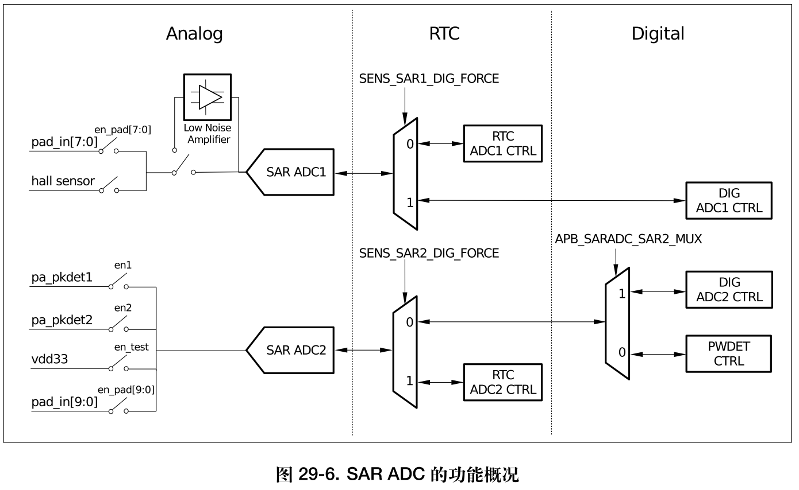
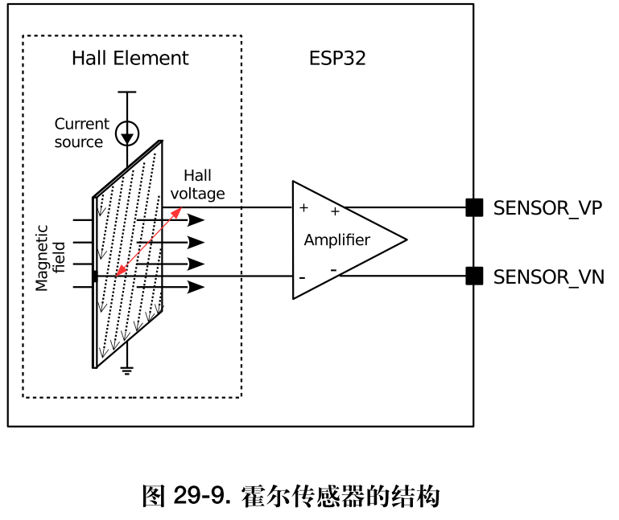

# ESP32 单片机学习笔记 - 04 - 例程学习

## 一、模拟数字转换器 ADC

> 编程指南：[Analog to Digital Converter](https://docs.espressif.com/projects/esp-idf/zh_CN/latest/esp32/api-reference/peripherals/adc.html)。
> 数据手册： [ESP32 技术参考手册 (PDF)](https://www.espressif.com/sites/default/files/documentation/esp32_technical_reference_manual_cn.pdf)，第二十九章的：*片上传感器与模拟信号处理*，官方将adc、dac、触摸按键、内部霍尔传感器都归为一类了。之后有需求就都学一下，现在就看看adc怎么用的先。
> 官方例程：[perials /adc/single_read](https://github.com/espressif/esp-idf/tree/639e7ad/examples/peripherals/adc/single_read)。

- 简介：ESP32 内置了 2 个 12 位的 SAR ADC，由 5 个专用转换器控制器管理，可测量来自 18 个管脚的模拟信号，还可测量 vdd33 等内部信号。SAR ADC 使用的 5 个控制器均为专用控制器，其中 2 个支持高性能多通道扫描、2 个经过优化可支持Deep-sleep 模式下的低功耗运行，另外 1 个专门用于 PWDET / PKDET （功率检测和峰值监测）。*SAR ADC 的功能概况见图*。（手册里表明了有哪些引脚，编程指南还标明了建议使用那些引脚）
- 技术手册上已说明，ADC只有2个单元（好像不能称为2个单元了，应该是一个单元2个模块多个通道），而且是只能检测规定的18个引脚（其中有部分还被占用了），另外还可以检测内部信号。



- 每个ADC单元支持两种工作模式，ADC单读模式和ADC连续(DMA)模式。ADC单读模式适用于低频采样操作。ADC连续(DMA)读模式适用于高频连续采样动作。
- 从一个没有连接到任何信号的引脚读取ADC是随机的。应该在读取之前配置ADC。注意`ADC1/2`的配置方式是不一样的。
- 1. 对于ADC1，可以通过调用`adc1_config_width()`和`adc1_config_channel_atten()`函数来配置所需的精度和衰减。
- 2. 对于ADC2，通过`adc2_config_channel_atten()`配置衰减。*ADC2的读数宽度在每次读取时进行配置*。
- 3. 配置引脚时是使用专门的枚举定义，而不是像之前那样填写可随意改动的引脚号：衰减配置是对每个通道进行的，参见`adc1_channel_t`和`adc2_channel_t`，设置为上述函数的参数。

> 在api手册中可以查到`adcn_config_channel_atten()`的注释：默认ADC电压用于衰减0 dB，在下表中列出。通过设置更高的衰减，可以读取更高的电压。由于ADC的特性，最准确的结果是在*下表*中显示的“建议范围”内获得的。每种不同的衰减对应电压是(`800mV、1100mV、1350mV、2600mV`)，居然量程范围是小于3.3V的吗？
> 而`adc1_config_width()`的注释为：配置ADC1捕获宽度，同时使能ADC1的输出反转。该配置适用于ADC1的所有通道。（参数可以设置为9、10、11、12位）

- 然后可以使用`adc1_get_raw()`和`adc2_get_raw()`读取ADC转换结果。ADC2的读取宽度应该设置为`adc2_get_raw()`的一个参数，而不是在配置函数中!!!

- 这个API提供了一种方便的方式来配置ADC1从ULP读取数据。为此，调用函数`adc1_ulp_enable()`，然后按上面讨论的那样设置精度和衰减。

> 还有另一个特定函数`adc_vref_to_gpio()`用于将内部参考电压路由到GPIO引脚。它方便校准ADC读数，这将在*最小化噪声*部分讨论。关于使用ADC单读模式的限制，请参阅*ADC的限制*。

### 1) 应用代码

> 不知道为什么我自己的工程编译时显示找不到头文件"esp_adc_cal.h"……

- 编程指南给出简单的几行代码，就可以实现ADC读取的功能。（例程里相对好长）

```C#
#include "driver/adc.h"
// #include "esp_adc_cal.h"            // 为什么找不到啊

/*
下述示例中的输入电压从0到1.1 V (0 dB衰减)。
输入范围可以通过设置更高的衰减来扩展，参见adc_atten_t。
使用包括校准在内的ADC驱动程序的一个例子可以在esp-idf中找到:
perials / ADC /single_read/ ADC
*/
void him_adc_init(void)
{
    adc1_config_width(ADC_WIDTH_BIT_12);
    /*!< ADC1 channel 0 is GPIO36 (ESP32), GPIO1 (ESP32-S2) */
    adc1_config_channel_atten(ADC1_CHANNEL_0,ADC_ATTEN_DB_11);
    int val = adc1_get_raw(ADC1_CHANNEL_0);
}

/*
读取可能会因为与Wi-Fi冲突而失败，
如果该API的返回值是ESP_ERR_INVALID_STATE，则读取结果无效。
一个使用ADC2驱动读取DAC输出的例子可以在esp-idf中找到:
peripherals/adc/single_read/ ADC2
*/
void him_adc2_init(void)
{
    int read_raw;
    adc2_config_channel_atten( ADC2_CHANNEL_7, ADC_ATTEN_0db );
    /*!< ADC2 channel 7 is GPIO27 (ESP32), GPIO18 (ESP32-S2) */
    esp_err_t r = adc2_get_raw( ADC2_CHANNEL_7, ADC_WIDTH_12Bit, &read_raw);
    if ( r == ESP_OK ) 
    {
        printf("%d\n", read_raw );
    } else if ( r == ESP_ERR_TIMEOUT ) 
    {
        printf("ADC2 used by Wi-Fi.\n");
    }
}
```

- 对比例程，例程中多了三个步骤（~~编程指南也没说这些步骤，只能查查api注释了。另外，例程说明写着有用到了dma的，但是我怎么没看到呢~~）：1）检查`Two Point`或`Vref`是否烧成`eFuse`。2）设置特征ADC（？）。3）转换 `adc_reading` 到电压mV。（例程在读取ADC时还使用了 *多重采样* 以减小误差）这些步骤在后面几小节说明。

### 2) 内部霍尔效应传感器

> 1. 根据霍尔效应，当电流垂直于磁场通过 N 型半导体时，会在垂直于电流和磁场的方向产生附加电场，从而在半导体两端形成电势差，具体高低与电磁场的强度和电流大小有关。当恒定电流穿过磁场或电流存在于恒定磁场时，霍尔效应传感器可用于测量磁场强度。霍尔传感器的应用场合非常广泛，包括接近探测、定位、测速与电流检测等。
> 2. ESP32 中的霍尔传感器经过专门设计，可向 SAR ADC 提供电压信号，实现磁场传感功能。在需要低电压的工作模式下，该传感器可由 ULP 协处理器控制。在此类功能的支持下，ESP32 具备的处理能力和灵活性均使其在位置传感、接近检测及测速等应用场景下成为一种极具吸引力的解决方案。
> 3. 霍尔传感器可将磁场转为电压，送入放大器内，而后通过管脚 `SENSOR_VP` 和管脚 `SENSOR_VN` 输出。ESP32内置 `ADC` 可将信号转化为数字值，交由 CPU 在数字域内完成以下操作。



- 可以通过调用专用函数`hall_sensor_read()`通过ADC1读取内部霍尔效应传感器。**请注意**，即使霍尔传感器是内部的ESP32，从它读取ADC1的通道0和3 (GPIO 36和39)。不要将其他任何东西连接到这些引脚上，也不要改变它们的配置。否则可能会影响传感器对低值信号的测量。

```C#
/*
读取内部霍尔效应传感器:在这两个示例中读取的值都是12位宽(范围0-4095)。
*/
void him_adc3_init(void)
{
    adc1_config_width(ADC_WIDTH_BIT_12);        // ADC1的，只需要设置宽度
    while(0)
    {
        int val = hall_sensor_read();           // 再使用函数读取即可。
        printf("val = %d\r\n",val);
        vTaskDelay(500 / portTICK_RATE_MS);
    }
}
```

- 不是很懂这个传感器是怎么用的，看描述是检测磁场的。但是我把核心板放在电磁感线上滑动，读出来的数值没有明显的规律变化（难道要外界放大器才可以？）。而且原来核心板上的`VP`和`VN`引脚是指这内部霍尔传感器的输出引脚，如果不读取霍尔传感器，那应该也可以作为普通ADC1模块的输入引脚？

### 3） 尽量减少噪音 Minimizing Noise

- ESP32 ADC对噪声很敏感，导致ADC读数有很大差异。为了减少噪音，用户在使用时可以在ADC输入垫上连接一个`0.1µF`的电容。**多重采样**也可以用来进一步减轻噪声的影响。（例程用的是多重采样）

```C#
#define NO_OF_SAMPLES   64          //Multisampling 多重采样 抗锯齿 多级采样 多采样
//Multisampling 多重采样
for (int i = 0; i < NO_OF_SAMPLES; i++) {
    if (unit == ADC_UNIT_1) {
        adc_reading += adc1_get_raw((adc1_channel_t)channel);
    } else {
        int raw;
        adc2_get_raw((adc2_channel_t)channel, width, &raw);
        adc_reading += raw;
    }
}
adc_reading /= NO_OF_SAMPLES;
```

### 4） ADC校准 ADC Calibration

- `esp_adc_cal/include/esp_adc_cal.h` API提供了一些函数，用于校正芯片间ADC参考电压(`Vref`)变化导致的测量电压差异。每个设计的ADC参考电压是1100 mV，然而在不同的ESP32s中真正的参考电压可以从1000 mV到1200 mV。

> 但是我不知道为什么找不到这个头文件………………最后无奈，直接到原地址把头文件拷贝到了我的工程目录下才通过了编译。

- 使用此API校正ADC读数涉及在给定衰减下表征其中一个ADC，以获得考虑到ADC参考电压差异的特性曲线(ADC-电压曲线)。特性曲线的形式为`y = coeff_a * x + coeff_b`，用于将ADC读数转换为以mV为单位的电压。特性曲线的计算基于可存储在`euse`或*由用户提供的校准值*。

```C#
static void check_efuse(void)
{
    //Check if TP is burned into eFuse 检查TP是否烧入熔断器
    if (esp_adc_cal_check_efuse(ESP_ADC_CAL_VAL_EFUSE_TP) == ESP_OK) 
        printf("eFuse Two Point: Supported\n");
    else 
        printf("eFuse Two Point: NOT supported\n");
        
    //Check Vref is burned into eFuse 检查Vref被烧入eFuse
    if (esp_adc_cal_check_efuse(ESP_ADC_CAL_VAL_EFUSE_VREF) == ESP_OK) 
        printf("eFuse Vref: Supported\n");
    else 
        printf("eFuse Vref: NOT supported\n");
    
}

#define DEFAULT_VREF    1100
static esp_adc_cal_characteristics_t *adc_chars;
//Characterize ADC Characterize ADC 特征ADC特征ADC
adc_chars = calloc(1, sizeof(esp_adc_cal_characteristics_t));
/*
说明：  描述ADC在特定衰减下的特性。
        该函数将表征ADC在特定衰减下的特性，并生成ADC-电压曲线，形式为[y = coeff_a * x + coeff_b]。
        表征可以基于两点值，eFuse Vref，或默认Vref，校准值将按此顺序排列。
返回：  
        ESP_ADC_CAL_VAL_EFUSE_VREF:用于表征的 eFuse Vref 参考电压
        ESP_ADC_CAL_VAL_EFUSE_TP:用于表征的两个点值(仅在线性模式下)
        ESP_ADC_CAL_VAL_DEFAULT_VREF:用于表征的默认Vref
参数：
        adc_num ： 模块号
        atte ： 衰减
        bit_width ： 位宽配置
        default_vref ： 默认ADC参考电压mV(仅在ESP32中，在eFuse值不可用时使用)
        chars ： 指向用于存储ADC特征的空结构的指针
*/
esp_adc_cal_value_t val_type = esp_adc_cal_characterize(unit, atten, width, DEFAULT_VREF, adc_chars);
```

- 编程指南还提到了 `校准值 Calibration Values` 没怎么看懂，就不归纳了。这一节的校准也不太看得懂，总之校准之后，使用`esp_adc_cal_raw_to_voltage()`函数就可以直接转换电压了，如果前面校准正确的。不过我以前在应用中都是软件实现的，手动测量ADC读值和实际电压的关系，然后软件乘于权重转换。所以简单应用的话只需要一开始那三行就可以了，好下一个知识点（~~迫不及待的快点跳过没用过的知识~~）。

> 编程指南最后还有一节：*应用程序扩展 Application Extensions* ：
> 完整的示例请参见esp-idf: [perials /adc/single_read](https://github.com/espressif/esp-idf/tree/639e7ad/examples/peripherals/adc/single_read)。
> 1. 具有特定衰减特性的ADC:
> 2. 读取ADC，然后将读数转换为电压:
> 3. 将ADC参考电压路由到GPIO，因此可以手动测量(对于`Default Vref`):


## 二、通用定时器

> 编程指南：[通用定时器](https://docs.espressif.com/projects/esp-idf/zh_CN/latest/esp32/api-reference/peripherals/timer.html)，久违的中文指南。
> 数据手册： [ESP32 技术参考手册 (PDF)](https://www.espressif.com/sites/default/files/documentation/esp32_technical_reference_manual_cn.pdf)，第十八章的：*定时器组 (TIMG)*。
> 官方例程：[peripherals/timer_group](https://github.com/espressif/esp-idf/tree/639e7ad/examples/peripherals/timer_group)。

- 简介：ESP32 芯片提供两组硬件定时器，每组包含两个通用硬件定时器。所有定时器均为 64 位通用定时器，包括 16 位预分频器和 64 位自动重载向上/向下计数器。ESP32 的定时器分为 2 组，每组 2 个。（剩下的介绍就不复制粘贴了，都中文指南了）

- 使用方法：结构体+函数（也可以个别专有函数单独设置），初始化后使能，定时器就会开始运作。
- 新概念，警报。指南翻译用语，并不是特指中断，而是指定时器到达时间了，会*触发中断*和*是否重装载值*。另外，请勿搞混了，*警告值*和*重装载值*是不一样的。一个是结束值，一个是开始值。而且只有重装载值是自动的，警告值每次都要自己设置…………
- 如果要用警报，使能警报，警报触发后会自动关闭，要手动重新使能。还有*中断事务*，手动注册一个中断的回调函数。
- 如果要用中断，给某个定时器注册一个中断回调函数，顾名思义，该函数会在中断上下文中被执行，因此用户不能在回调函数中调用任何会阻塞 CPU 的 API。相较于从头编写中断处理程序，使用中断回调函数的好处是，用户无需检测和处理中断的状态位，这些操作会由驱动中默认的中断处理程序替我们完成。*注意！！* 也就是说**中断回调函数**和**中断处理程序**是两种不同的使用方法，想起来上一篇中使用编码器的例程时，两个例程也是分别用了2种情况。可以对比理解（？如果我没理解错的话）。

>~~ 指南就这么多，直接开始上代码~~

- 下面是例程的主要初始化配置函数，其中重装载值为0，警告值由传参决定。开启了中断，其中提到了 `ISR`中断函数 虽然之前大概明白和 `Task`任务函数 是不一样的，但是没太懂其具体的配置。这里给了个释放，其函数的注释没看懂，简而言之就是注意2点就好了，在中断函数中要*读取标志*和*清除标志*两步骤。还要头尾加上`timer_spinlock_take()`和`timer_spinlock_give()`。

```C#
static void example_tg0_timer_init(int timer_idx,
                                   bool auto_reload, double timer_interval_sec)
{
    /*初始化定时器的基本参数*/
    /* Select and initialize basic parameters of the timer */
    timer_config_t config = {
        .divider = TIMER_DIVIDER,           // 计数器时钟分频器。范围从2到65536。
        .counter_dir = TIMER_COUNT_UP,      // 计数方向
        .counter_en = TIMER_PAUSE,          // 使能定时器————————————————————————————开启这个后再初始化就会直接启动定时器
        .alarm_en = TIMER_ALARM_EN,         // 定时报警使
        .auto_reload = auto_reload,         // 定时器自动重载
        // .intr_type = TIMER_INTR_LEVEL,   // 参数只有一个枚举可以设置…………如果运行在告警模式下，请选择中断类型。
    }; // default clock source is APB 默认时钟源为APB，这个结构体有一个被屏蔽的参数，是用来设置时钟源的，应该是想保持默认
    timer_init(TIMER_GROUP_0, timer_idx, &config);      // ESP32 的定时器分为 2 组，每组 2 个。

    /* Timer's counter will initially start from value below. Timer的计数器将从下面的值开始。
       Also, if auto_reload is set, this value will be automatically reload on alarm 另外，如果设置了auto_reload，这个值将在告警时自动重新加载 */
    timer_set_counter_value(TIMER_GROUP_0, timer_idx, 0x00000000ULL);           // 指定定时器的首个计数值（同时这个值也是每次的重装载的值）

    /*设置告警值和中断告警。* /
    /* Configure the alarm value and the interrupt on alarm. */
    timer_set_alarm_value(TIMER_GROUP_0, timer_idx, timer_interval_sec * TIMER_SCALE);      // 但是还没使能，第三个参数是设置警告值。
                                                                                // 请勿搞混了，警告值和重装载值是不一样的。一个是结束值，一个是开始值。
    timer_enable_intr(TIMER_GROUP_0, timer_idx);                                // 允许定时中断，单独设置函数？
    /*
    寄存器定时器中断处理程序，这个处理程序是一个ISR。处理程序将被附加到运行此函数的同一CPU核心上。
    如果设置了 intr_alloc_flags 值 ESP_INTR_FLAG_IRAM ，则处理函数必须声明为 IRAM_ATTR 属性，并且只能调用 IRAM 或 ROM 中的函数。
    它不能调用其他计时器api。在这种情况下，使用直接注册访问从ISR内部配置计时器。

    如果使用此函数重新注册ISR，则需要编写完整的ISR。
    在中断处理程序中，您需要在处理之前调用timer_spinlock_take(..)，在处理之后调用timer_spinlock_give(…)。（在上面的中断函数中可以看到）
     */ 
    timer_isr_register(  
        TIMER_GROUP_0,              // 定时器组号
        timer_idx,                  // 定时器组的定时器索引
        timer_group0_isr,           // 中断处理程序函数
        (void *) timer_idx,         // 处理函数参数             // 注意，参数是无符合指针类型，所以先强制类型转换了，在中断函数再转回去。
        ESP_INTR_FLAG_IRAM,         // 用于分配中断的标志
        NULL);                      // 返回句柄的指针。

    timer_start(TIMER_GROUP_0, timer_idx);      // 使能定时器
}
```

- 下面是中断函数的示例（已删除些不必要的内容），注意进入中断后 还要重新 *设置警告值* 和 *警报中断*。

```C#
void IRAM_ATTR timer_group0_isr(void *para)
{
    timer_spinlock_take(TIMER_GROUP_0);                                                         // 和结尾的 timer_spinlock_give 搭配使用

    /* Retrieve the interrupt status and the counter value 获取中断状态和计数器值
       from the timer that reported the interrupt 从报告中断的定时器 */
    uint32_t timer_intr = timer_group_get_intr_status_in_isr(TIMER_GROUP_0);                        // 获取中断状态，只在ISR中使用。
    uint64_t timer_counter_value = timer_group_get_counter_value_in_isr(TIMER_GROUP_0, timer_idx);  // 获取当前的计数器值，只是在ISR中使用。

    /* Clear the interrupt 清除中断
       and update the alarm time for the timer with without reload 并更新定时器的报警时间与不重载 */
    if (timer_intr & TIMER_INTR_T0) 
    {                                                           // 获取标志位
        timer_group_clr_intr_status_in_isr(TIMER_GROUP_0, TIMER_0);                             // 清除定时器中断状态，仅在ISR中使用。
        timer_counter_value += (uint64_t) (TIMER_INTERVAL0_SEC * TIMER_SCALE);
        timer_group_set_alarm_value_in_isr(TIMER_GROUP_0, timer_idx, timer_counter_value);     // 设置定时器的告警阈值，仅在ISR中使用。
    } 
    else if (timer_intr & TIMER_INTR_T1) 
    {
        timer_group_clr_intr_status_in_isr(TIMER_GROUP_0, TIMER_1);                             // 清除定时器中断状态，仅在ISR中使用。
    } 
    else 
    {
        // not supported even type 类型都不支持
    }

    /* After the alarm has been triggered 当告警被触发后
      we need enable it again, so it is triggered the next time 我们需要再次启用它，以便下次触发它 */
    timer_group_enable_alarm_in_isr(TIMER_GROUP_0, timer_idx);                                  // 启用警报中断，仅在ISR中使用。

    timer_spinlock_give(TIMER_GROUP_0);                                                         // 和开头的 timer_spinlock_take 搭配使用
}
```

- 剩下的是主函数调用和主循环等待接收队列打印测试内容。就贴代码了。以上就是定时器组的总结笔记。