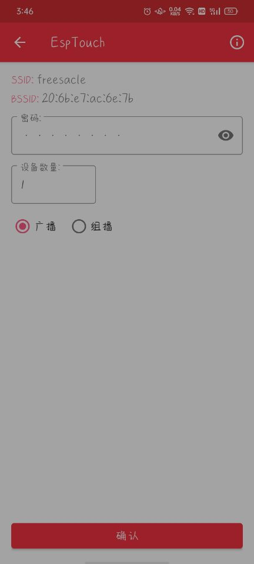
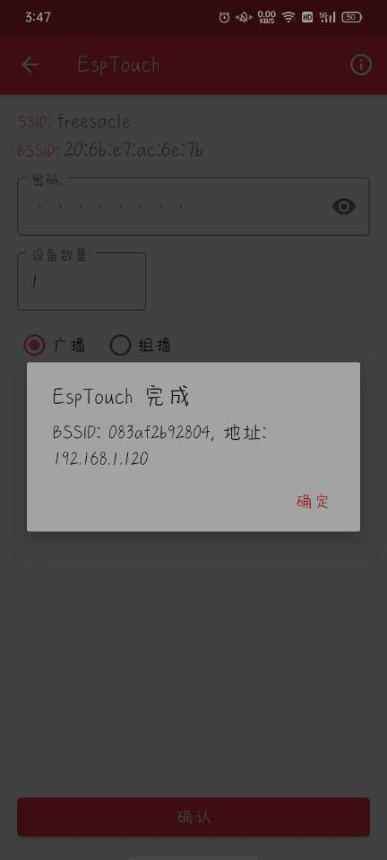

# ESP32 单片机学习笔记 - 05 - 例程学习

> 终于把感觉必要的基础外设学完了，开始学esp32的*主要特色功能*——物联网~~？（大概）

# 一、WIFI热点 AP模式

> 编程指南： 在API库中的[Wi-Fi 库](https://docs.espressif.com/projects/esp-idf/zh_CN/latest/esp32/api-reference/network/esp_wifi.html)栏目只有简单的几句介绍，要看更多内容，可以到API指南的[Wi-Fi 驱动程序](https://docs.espressif.com/projects/esp-idf/zh_CN/latest/esp32/api-guides/wifi.html)中查看。这一节先说[ESP32 Wi-Fi AP 一般情况](https://docs.espressif.com/projects/esp-idf/zh_CN/latest/esp32/api-guides/wifi.html#esp32-wi-fi-ap)的内容。
> 教程笔记： [第十四章 ESP32 新建一个WIFI热点](https://blog.csdn.net/qq_24550925/article/details/85853334)，基础部分已经自行补完后继续跟着教程学wifi联网部分。
> 官方例程：

> 在编程指南里有一张下图 "*AP 模式下 Wi-Fi 事件场景示例*" ，可以结合例程对比学习。
> 吐槽：不知道为什么不能找不到头文件，本来还想着老套路扣一个头文件就可以了，没想到这次不一样，是多个头文件嵌套的。单纯编译原本的官方wifi例程都要许久。所以我直接放弃学基础外设时用的工程，直接在官方例程中实验。


- 先补充一下WiFi的三种模式：AP、STA、AP+STA。之前在小破站找到*太极创客*发布基于`ESP8266`的教程，虽然我用的esp32，不过其教程的前期对物联网的科普知识还是可以看一下的。比如：[互联网知识基础-链路层 （第2章 – 第2节）](http://www.taichi-maker.com/homepage/esp8266-nodemcu-iot/internet-basics/link-layer/)，就说明了WiFi其实就是链路层的一种。（~~组态和总线的专业课白学了~~）

- 例程的功能就是创建了一个wifi网络，然后可以用手机连接，就没其他功能了。因为esp32wifi底层驱动是不开源的，所以基本上没什么能改动的，就是全调用，参数都比较少。只是调用的有点多……

- 1. 第一步 - 初始化阶段（对应上图中的流程）：共四步，对应下面的代码。 在初始化函数中调用（连参数都不用，省了很多事）。需要注意的就是在 `1.4 创建应用程序任务` 之前，想要先调用`esp_wifi_init()`分配资源，而用到的参数是用*宏定义函数*获取（就算有参数也被封装得看不到了2333）。

```C#
ESP_ERROR_CHECK(esp_netif_init());                      // 1.1. 初始化底层TCP/IP堆栈。
ESP_ERROR_CHECK(esp_event_loop_create_default());       // 1.2. 创建默认事件循环。
esp_netif_create_default_wifi_ap();                     // 1.3. 创建默认的WIFI AP。在任何init错误的情况下，此API将中止。

wifi_init_config_t cfg = WIFI_INIT_CONFIG_DEFAULT();    // wifi init config default 获取Wifi初始化配置默认
ESP_ERROR_CHECK(esp_wifi_init(&cfg));                   // Init WiFi 为WiFi驱动分配资源，如WiFi控制结构、RX/TX缓冲区、WiFi NVS结构等，该WiFi也启动WiFi任务。

                                                        //1.4. 向默认循环注册一个事件处理程序实例。
ESP_ERROR_CHECK(esp_event_handler_instance_register(WIFI_EVENT,             // 要为其注册处理程序的事件的基本id 。
                                                    ESP_EVENT_ANY_ID,       // 要为其注册处理程序的事件的id。
                                                    &wifi_event_handler,    // 当事件被分派时被调用的处理函数。
                                                    NULL,                   // 除事件数据外，在调用处理程序时传递给该处理程序的数据。
                                                    NULL));                 // 与注册事件处理程序和数据相关的事件处理程序实例对象可以是NULL。
```

- 2. 第二步 - 配置阶段：注意使用`wifi_config_t`结构体中的`ap`共用体配置参数。而且还要增加判断密码内容，如果密码是空，那就将wifi设置为*开放连接*。在调用结构体初始化前，还要先设置工作模式为AP。

```C#
wifi_config_t wifi_config = {
    .ap = {
        .ssid = EXAMPLE_ESP_WIFI_SSID,                  // wifi 名字
        .ssid_len = strlen(EXAMPLE_ESP_WIFI_SSID),      // wifi 名字 的长度
        .channel = EXAMPLE_ESP_WIFI_CHANNEL,            // 设置为1~13，表示从指定的通道开始扫描，然后再连接AP。如果AP的通道未知，则设置为0。
        .password = EXAMPLE_ESP_WIFI_PASS,              // wifi 密码
        .max_connection = EXAMPLE_MAX_STA_CONN,         // 允许连接的最大站数，默认4，最大10
        .authmode = WIFI_AUTH_WPA_WPA2_PSK              /**<认证模式:WPA_WPA2_PSK */ // ESP32软ap的认证模式。软ap模式下不支持AUTH_WEP
    },
};
if (strlen(EXAMPLE_ESP_WIFI_PASS) == 0)                 // 如果密码为空，那 “认证模式” 就设为 开放模式
{
    wifi_config.ap.authmode = WIFI_AUTH_OPEN;
}

ESP_ERROR_CHECK(esp_wifi_set_mode(WIFI_MODE_AP));       // 2.0. 设置WiFi工作模式。 AP模式
ESP_ERROR_CHECK(esp_wifi_set_config(ESP_IF_WIFI_AP, &wifi_config));         // 2.0. 配置ESP32 STA / AP的配置信息。
```

- 3. 第三步 - 启动阶段：配置好前面的内容后一个函数启动。然后图表后面的阶段就是底层库完成的事情了。如果要关闭wifi的话，第六步的*清理阶段*还需要另设置（暂用不到）。

```C#
ESP_ERROR_CHECK(esp_wifi_start());                      // 3.1. 根据当前配置启动WiFi
```

- 4. 第零步 - 在例程调用初始化函数前，还有一步分区操作，没看懂，先贴出来。

```C#
//Initialize NVS 初始化默认NVS分区。
esp_err_t ret = nvs_flash_init();       

/* !< NVS分区不包含任何空页。如果NVS分区被截断，可能会发生这种情况。擦除整个分区并再次调用nvs_flash_init。*/
/* !< NVS分区包含新格式的数据，不能被此代码版本识别*/
if (ret == ESP_ERR_NVS_NO_FREE_PAGES || ret == ESP_ERR_NVS_NEW_VERSION_FOUND) 
{
    /*擦除默认NVS分区。擦除默认NVS分区(标签为“NVS”)的所有内容。*/
    ESP_ERROR_CHECK(nvs_flash_erase());
    ret = nvs_flash_init();                 // 重新初始化
}
ESP_ERROR_CHECK(ret);                       // 如果还没成功就报错
```

- 5. 设置的应用程序，是但触发中断时进入的。例程的试验效果就是：当设备连接或断开时会进入中断，并终端打印日志。

```C#
// 1.4. 创建应用程序任务            // 中断服务函数 
static void wifi_event_handler(void* arg, esp_event_base_t event_base,
                                    int32_t event_id, void* event_data)
{   
    if (event_id == WIFI_EVENT_AP_STACONNECTED)                     // 一个工作站连接到ESP32软ap 
    {
        wifi_event_ap_staconnected_t* event = (wifi_event_ap_staconnected_t*) event_data;
        ESP_LOGI(TAG, "station "MACSTR" join, AID=%d",              // 连接 join
                 MAC2STR(event->mac), event->aid);
    } 
    else if (event_id == WIFI_EVENT_AP_STADISCONNECTED)             // 一个从ESP32软ap断开的工作站
    {
        wifi_event_ap_stadisconnected_t* event = (wifi_event_ap_stadisconnected_t*) event_data;
        ESP_LOGI(TAG, "station "MACSTR" leave, AID=%d",             // 剩下 leave
                 MAC2STR(event->mac), event->aid);
    }
}
```

## 二、Smart Config 智能 配置

> 编程指南： [SmartConfig](https://docs.espressif.com/projects/esp-idf/zh_CN/latest/esp32/api-reference/network/esp_smartconfig.html?highlight=smart%20config) ，也只有一点介绍，没介绍具体流程。感觉这个模式应该和`station模式 `差不多，和`AP模式`相对的，一个属于连接别人，一个是被别人连接。[ESP32 Wi-Fi station 一般情况](https://docs.espressif.com/projects/esp-idf/zh_CN/latest/esp32/api-guides/wifi.html#esp32-wi-fi-station)。
> 教程笔记： [第十五章 ESP32的SmartConfig一键配置](https://blog.csdn.net/qq_24550925/article/details/85854611)。
> 官方例程：[wifi/smart_config](https://github.com/espressif/esp-idf/tree/639e7ad/examples/wifi/smart_config)。
> 使用工具： [EspTouch](https://www.espressif.com/zh-hans/support/download/apps?keys=) ，例程会用到一个APP。这个app是开源的，在github上也可以下载。

> 经过几次测试，终于发现到底是为什么一直找不到头文件了。因为我已经把能找到的配置文件全部都替换了依旧是找不到头文件，我便开始怀疑不是配置文件的问题。毕竟我都能跳转，只是它工程编译时找不到。我把目光转向了`.c`文件的目录，我尝试把找不到的头文件放在主目录main下`.c`文件内。居然就通过编译了。所以目前推断`wifi`这种大项目的工程，wifi头文件的导入一定要在主目录？（不科学啊）？？而且我发现在编译之后工程里除了`build`生成了很多文件外，工程的`main`目录和底目录也会生成一些额外文件……~~难道是因为在我自己创建的文件夹里无法生成所以才找不到头文件？~~

> 我之前为了方便和整合，把例程都单独放一个文件里，如果要运行例程的`.c`就会把主`.c`的内容屏蔽，添加例程文件的地址，再编译。之前这种方法都是可行的，因为工程不在乎我在哪里定义了`app_main`主函数，所以我会在例程和自己的程序之间来回切换。但是就是不知道为什么运行wifi相关的例程时就不行了……

- `Smart Config`中文翻译，`智能配置`。其功能就是使用第三方设备（我用的是安卓平台上的app：`EspTouch`）给esp32配置网络。如果没有准备可操作界面时，使用这种方式配置网络会相当方便。
- 主要流程：先下载例程和app，然后手机连接wifi(暂不支持5G)，然后打开app连接，esp32会接收到手机发送的wifi的`pswd`和`ssid`。然后主动连接，如果连接成功会串口打印日志。如下（我已屏蔽了WiFi密码内容，实质上会直接打印）

 

```
I (7450) smartconfig_example: Found channel
I (10770) smartconfig: T|pswd: (密码)
I (10770) smartconfig: T|ssid: freesacle
I (10770) smartconfig: T|bssid: 20:6b:e7:ac:6e:7b
I (10780) wifi:ic_disable_sniffer
I (10780) smartconfig_example: Got SSID and password
I (10780) smartconfig_example: SSID:freesacle
I (10790) smartconfig_example: PASSWORD:(密码)
I (10940) wifi:new:<1,0>, old:<1,0>, ap:<255,255>, sta:<1,0>, prof:1
I (11720) wifi:state: init -> auth (b0)
I (11760) wifi:state: auth -> assoc (0)
I (11780) wifi:state: assoc -> run (10)
I (12020) wifi:connected with freesacle, aid = 6, channel 1, BW20, bssid = 20:6b:e7:ac:6e:7b
I (12020) wifi:security: WPA2-PSK, phy: bgn, rssi: -46
I (12030) wifi:pm start, type: 1

I (12070) wifi:AP's beacon interval = 102400 us, DTIM period = 1
I (13610) esp_netif_handlers: sta ip: 192.168.1.120, mask: 255.255.255.0, gw: 192.168.1.1
I (13610) smartconfig_example: WiFi Connected to ap
I (16620) smartconfig_example: smartconfig over
```

- 先来看看例程中初始化wifi的部分，和上一节学习AP模式时一样，我们看看`station`的配置框架图，前半部分和AP模式大致相同，第四阶段后就多了连接wifi一步。


-  第零步：和ap模式一样，在初始化wifi一系列操作前需先执行

```C#
ESP_ERROR_CHECK( nvs_flash_init() );            // 初始化默认NVS分区。
```

- 第一步 - 配置阶段：和ap模式基本一样，不同的就是创建的是`wifi_sta`而不是`wifi_ap`。
- 第二行*创建事件组*是为了调试用，最后几行*创建事件处理程序*也是为了调试用，不过在这个例程中用到的`esp_event_handler_register()`函数属于即将过期函数，api手册推荐使用`esp_event_handler_instance_register()`函数（ap模式例程中的那个）。整篇看下来发现这个例程用到挺多旧函数的，api手册都推荐表示使用其他代替，相比之下上一个例程就比较新。

```C#
ESP_ERROR_CHECK(esp_netif_init());                                              // 1.1. 初始化底层TCP/IP堆栈。
s_wifi_event_group = xEventGroupCreate();                                       // 创建一个新的事件组。
ESP_ERROR_CHECK(esp_event_loop_create_default());                               // 1.2. 创建默认事件循环。
esp_netif_t *sta_netif = esp_netif_create_default_wifi_sta();                   // 创建默认的WIFI STA。在任何初始化错误的情况下，这个API将中止。
assert(sta_netif);

wifi_init_config_t cfg = WIFI_INIT_CONFIG_DEFAULT();                            // 获取Wifi初始化配置默认
ESP_ERROR_CHECK( esp_wifi_init(&cfg) );                                         // 为WiFi驱动分配资源，如WiFi控制结构、RX/TX缓冲区、

/* 向系统事件循环(遗留)注册一个事件处理程序。 
event_base : 要为其注册处理程序的事件的基本id;
event_id : 要为其注册处理程序的事件的id;
event_handler : 当事件被分派时被调用的处理函数;
event_handler_arg : 除事件数据外，在调用处理程序时传递给该处理程序的数据;
*/
ESP_ERROR_CHECK( esp_event_handler_register(WIFI_EVENT, ESP_EVENT_ANY_ID, &event_handler, NULL) );  
ESP_ERROR_CHECK( esp_event_handler_register(IP_EVENT, IP_EVENT_STA_GOT_IP, &event_handler, NULL) );
ESP_ERROR_CHECK( esp_event_handler_register(SC_EVENT, ESP_EVENT_ANY_ID, &event_handler, NULL) );
```

- 第二步 - 配置阶段 和 第三步 - 启动阶段：开启wifi时没有像ap模式那样设置参数（wifi密码、名字等），应该是因为我开启的是sta模式，这些参数都是要另外接收的。

```C#
ESP_ERROR_CHECK( esp_wifi_set_mode(WIFI_MODE_STA) );                            // 2.0. 设置WiFi工作模式。 STA模式
ESP_ERROR_CHECK( esp_wifi_start() );                                            // 3.1. 根据当前配置启动WiFi
```

- 第四步 - 连接阶段：当手机给esp32发送配置信息时，会使程序进入*事件处理程序*的`SC_EVENT`*找到SSID和密码了*事件中。然后就是配置参数，连接WiFi了。
- 在事件处理程序中还有很多其他事件，都是调试反馈使用，重点的就是下面这段。

```C#
wifi_config_t wifi_config;                      // 下面开始 ESP32的STA配置。
bzero(&wifi_config, sizeof(wifi_config_t));     // 清零 数据
memcpy(wifi_config.sta.ssid, evt->ssid, sizeof(wifi_config.sta.ssid));      // 拷贝 参数
memcpy(wifi_config.sta.password, evt->password, sizeof(wifi_config.sta.password));

ESP_ERROR_CHECK( esp_wifi_disconnect() );                                   // 将ESP32 WiFi站与AP断开连接。
ESP_ERROR_CHECK( esp_wifi_set_config(ESP_IF_WIFI_STA, &wifi_config) );      // 配置ESP32 STA / AP的配置信息。
ESP_ERROR_CHECK( esp_wifi_connect() );                                      // 将ESP32 WiFi站连接到AP。
```

- 注意，这个历程并没有写保存wifi配置个能，即每次上电复位都要重新配置。

## 三、 FreeRTOS

- 注意到，2个例程中都使用到了*事件组*、*事件处理函数*等操作。

> 既然已经使用了 `FreeRTOS` 系统和wifi等功能，那应该就要认真学习一下这种思维。之后写程序要多运用！