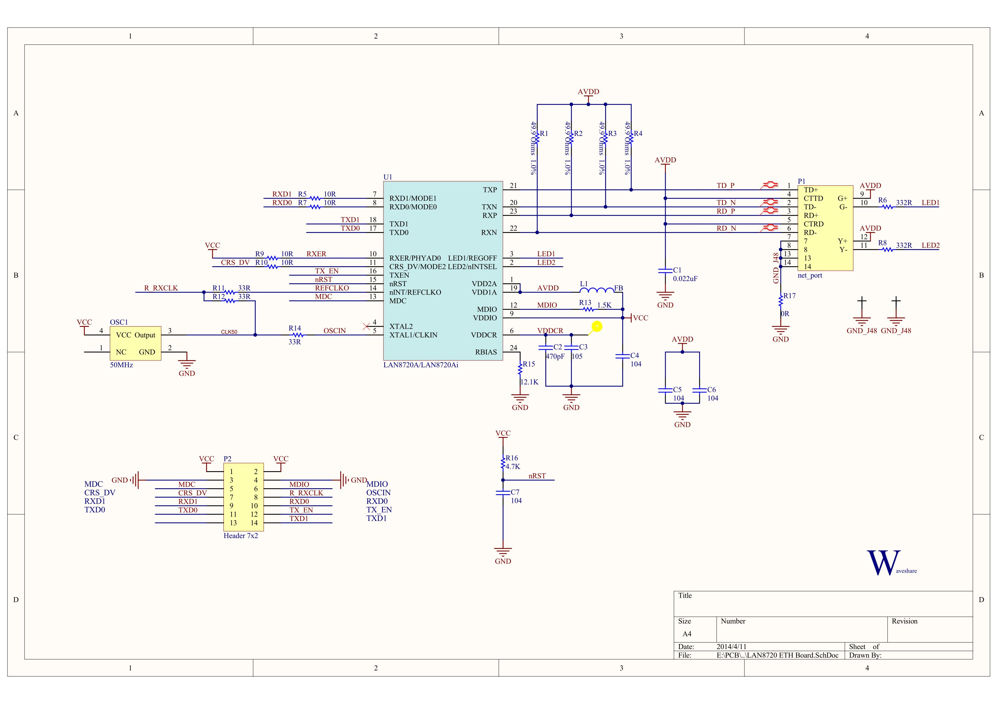
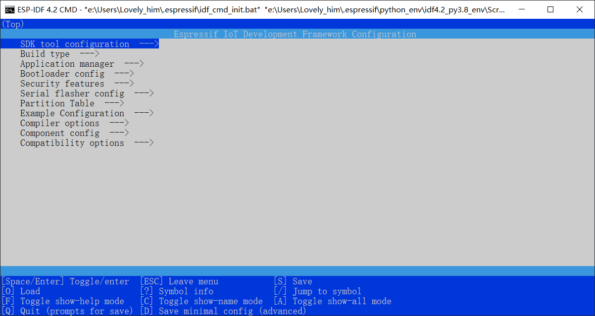
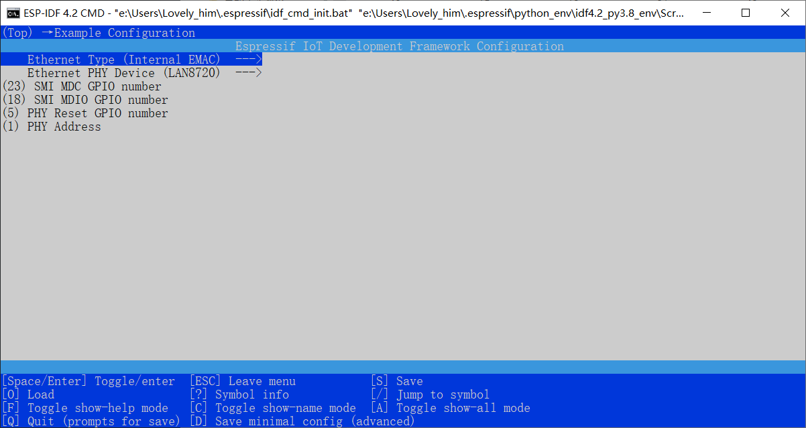
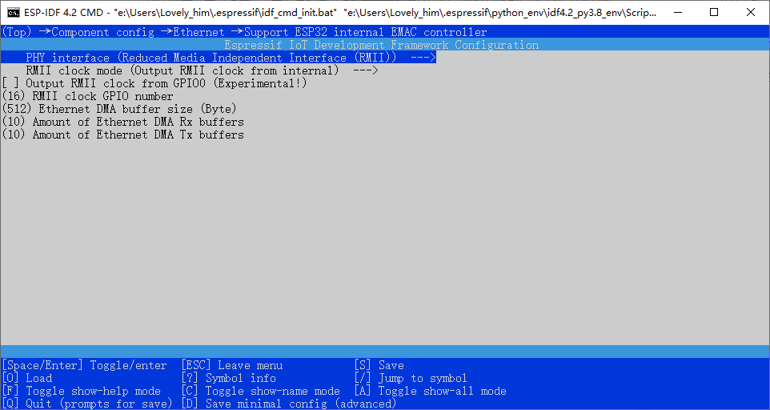
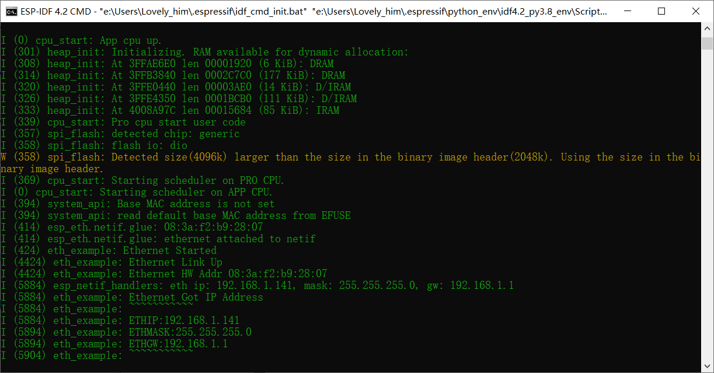
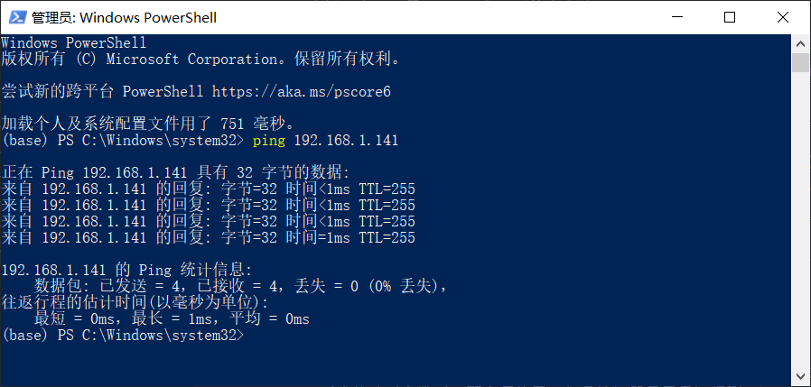
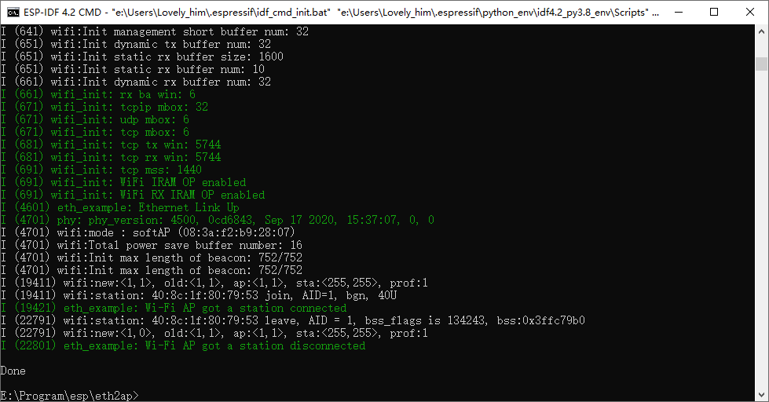

ESP32 单片机学习笔记 - 05 - 例程学习

> 暂停了半个多月的学习，去调车了。现在课设开始了，赶紧回来把一开始的“以太网”目标学完。但是却发现，好像和自己的理解不太一样。

@[TOC]

# 一、以太网基本示例 - Ethernet

> 编程指南：[以太网](https://docs.espressif.com/projects/esp-idf/zh_CN/latest/esp32/api-reference/network/esp_eth.html)，啥介绍都没有，我啥了。我把例程都作为后还是清楚怎么用以太网，就发觉自己是不是理解错了，学习方向/顺序是不是错了。
> 官方例程：[ethernet/basic](https://github.com/espressif/esp-idf/tree/1d7068e/examples/ethernet/basic)，这个例程只有以太网连接功能。
>
> > 编程指南（英文）：[Ethernet](https://docs.espressif.com/projects/esp-idf/en/latest/esp32/api-reference/network/esp_eth.html?highlight=esp_eth_set_default_handlers)，惊呆了，原来所有内容都在英文版，中文版一个字没有。

## 1.确定方案

> 先明白一下概念，以下百科内容：
> 1. 以太网（ Ethernet ）是应用最广泛的局域网通讯方式，同时也是一种协议。以太网协议定义了一系列软件和硬件标准，从而将不同的计算机设备连接在一起。以太网（ Ethernet ）设备组网的基本元素有交换机、路由器、集线器、光纤和普通网线以及以太网协议和通讯规则。以太网中网络数据连接的端口就是以太网接口。
> 2. 以太网接口TCP/IP协议。
> 3. 几种常见的以太网接口类型：SC光纤接口、RJ-45接口、FDDI接口、BNC接口、Console接口。

- 根据上述百科，我明白到：以太网是**局域网**的通讯方式,以太网是具有**TCP/IP协议**，以太网常用接口有**RJ45接口**。
- 搜索“ESP32 以太网”得到几个方案，大致可以分为两类。1）使用转协议模块，将以太网转为`uart、spi`等方式通讯。2）使用直连模块，直接使用`RMII协议`链接以太网。而这些模块一般就是一个`PHY芯片`，加一个输入网络接口和一排输出排针组成。

> 意识到我好像还不懂`PHY`是什么，百科内容以下：(TCP/IP协议也不懂，不过下一章再补充，和学习例程时一起补充)
> 1. PHY（英语：Physical），中文可称之为端口物理层，是一个对[OSI模型物理层](https://baike.baidu.com/item/OSI%E6%A8%A1%E5%9E%8B)的共同简称。
> 2. PHY连接一个数据链路层的设备（MAC）到一个物理媒介，如光纤或铜缆线。（也就是说：单片机设备或电脑设备 - PHY芯片 - 网线）
> 3. PHY是一个操作OSI模型物理层的设备。*一个以太网PHY是一个芯片*，可以发送和接收以太网的数据帧（frame）。它通常缺乏NIC（网络接口控制器）芯片所提供的Wake-on-LAN或支持Boot ROM的先进功能。此外，不同于NIC，PHY没有自己的MAC地址。

- 在找“ESP32 以太网”时，找到一个帖子，属个人论坛的：[ESP32 有线接入以太网方法 ](https://www.guaishow.cn/archives/84/)，介绍到可以使用`LAN8720芯片`将ESP32接入以太网。
- 乐鑫也有这种方案的模块：[ESP32-Ethernet-Kit V1.2 入门指南](https://docs.espressif.com/projects/esp-idf/zh_CN/latest/esp32/hw-reference/esp32/get-started-ethernet-kit.html?highlight=ethernet)，不过是在中间再加了一个转换模块，将以太网通讯转换为SPI通讯了？我想着要上就上原生接口，才能学到东西。所以选择某宝找“*LAN8720 网络模块 以太网收发器 ETH RMII 接口*”，提醒：这模块好像有原版和仿制之分，两者居然差了三倍多的价格。请购买时注意，自行选择。
- 以下是我购买的模块的资料：资料下载：`https://pan.baidu.com/s/1T_fFt56sM9qQ4bbrA2oHnA` 提取码：`6aqz`。取自某宝，因为不会失效吧……

## 2.准备工作

- 在选择好方案，模块到手后开始尝试。下载例程，看原理图，查接线。在例程 [examples/ethernet/](https://github.com/espressif/esp-idf/tree/1d7068e4be430edd92bb63f2d922036dcf5c3cc1/examples/ethernet) ，页面下的说明文档`README.md`中有说明接线方法。



- 特别说明了**RMII PHY接线固定**，共有6个引脚。**SMI 接线不固定**，共2个引脚。模块共11个有效引脚，8个信号引脚，2个电源引脚，1个晶振/复位引脚。
- 在模块原理图中可以得知，该模块上已经焊了一个50MHz的晶振供频率了。这个知识点注意，一会配置工程需要用到。

- 接好线后，还不可以，在说明文档`README.md`还有一步，配置工程。这一步操作，在[快速入门 第七步：配置](https://docs.espressif.com/projects/esp-idf/zh_CN/latest/esp32/get-started/index.html#get-started-configure)，中也有提到，不过之前的例程都不需要配置，所以我之前也没配置过。



- 在idf终端中，把目录地址切换到工程下，再使用指令：`idf.py menuconfig`就可以打开菜单界面。配置完毕后工程会生成一个`sdkconfig`的配置文件。再使用`idf.py build`指令编译工程后，工程会出现在`build/config`上生成一个`sdkconfig.h`的头文件。里面一堆宏定义，然后例程里一些配置的切换就是感觉这些宏定义来的。所以说，官方就是推荐在写工程时尽量使用这些宏定义，这样其他人用我工程时，就可以有可视化的界面来修改工程了。

- 这次例程中，只需要配置2个界面的内容就可以了。

- 1. 前2个选项要和我一样，（以太网类型）`Ethernet Type - Internal EMAC` ，模块选择 `LAN8720`。 2个SMI引脚我并为改动，使用默认，复位引脚也是。而最后一个是**PHY芯片地址设置**，根据模块原理图可以得知LAN8720的PHYAD0引脚接了上拉电阻，再根据帖子[ESP32 有线接入以太网方法 ](https://www.guaishow.cn/archives/84/)，可以知道`PHY Address`选择1即可。



- 2. 第一个选项要选择`RMII`，目前ESP32只支持这个模式。注意第二个选项，选择`Output RMII clock from internal`，虽然我并没有接esp的输出引脚给lan8720，不过因为我无法接lan8720的输出引脚到esp，所以不选输入，只能选择输出。选择输出后要设置引脚（16/17），我选择16。然后其他的东西暂时可以不用改了。



- 修改完毕后，把例程编译然后下载，看看实验现象。如果正常的话就会打印下图的内容，其中的IP地址因人而异。



- 踩坑总结：
- 1. 一开始我没配置对参数，50MHz的频率设置为输入，导致例程下载进去后单片机一直复位（监视器反复刷屏），然后通过看报错信息知道是开启以太网时就报错，然后复位。
- 2. 后来修改对参数后，不会复位了，但是监视器显示只运行到  `I (424) eth_example: Ethernet Started` 这一步就停止了，还是没有进入到第二步的 `I (4424) eth_example: Ethernet Link Up` 。找了好久问题才发现原来是网线坏了……我换了一根网线就好了，能正常打印后面的内容了。
- 最后一步，试试例程介绍中的`ping`指令。我一开始不知道，还以为是esp32的指令，在idf终端里输入，发现没效果。后来才知道原来这个是win系统的指令，在win10中另开一个终端，然后输入 `ping 192.168.1.141` ，其中的IP地址就是监视器中打印的，因人而异。然后就能下图的反馈信息。



- 然后就没了，进入下一步。例程解析。

## 3. 例程解析

1. 首先是前置操作，初始化TCP/IP（回忆：在开启wifi时也有这一步）。然后创建`默认事件循环`，`默认处理程序` 和 `事件处理程序`。

> 插入，之前都看到`默认事件循环`的使用，但是没太在意。现在理理思路，这个使用方法类似创建一个队列？
> 先创建一个默认事件循环，然后系统生成的所有事件都会进入到这默认事件循环。
> 虽然这些事件都进入到循环里，但是它们本身也有各自的事件类别。然后指定某类别的事件运行某事件处理程序。然后处理的顺序就按发生的事件顺序执行。处理程序的定义格式好像都是固定的？
> 找到编程指南里的介绍文档：[Default Event Loop](https://docs.espressif.com/projects/esp-idf/en/latest/esp32/api-reference/system/esp_event.html#default-event-loop)。

```c#
// 初始化TCP/IP网络接口(在应用程序中只能调用一次)
// Initialize TCP/IP network interface (should be called only once in application)
ESP_ERROR_CHECK(esp_netif_init());
// 创建在后台运行的默认事件循环
// Create default event loop that running in background
ESP_ERROR_CHECK(esp_event_loop_create_default());
esp_netif_config_t cfg = ESP_NETIF_DEFAULT_ETH();
esp_netif_t *eth_netif = esp_netif_new(&cfg);
// 设置默认处理程序来处理TCP/IP内容
// Set default handlers to process TCP/IP stuffs
ESP_ERROR_CHECK(esp_eth_set_default_handlers(eth_netif));
// 注册用户定义的事件处理程序
// Register user defined event handers
ESP_ERROR_CHECK(esp_event_handler_register(ETH_EVENT, ESP_EVENT_ANY_ID, &eth_event_handler, NULL));
ESP_ERROR_CHECK(esp_event_handler_register(IP_EVENT, IP_EVENT_ETH_GOT_IP, &got_ip_event_handler, NULL));
```

2. 以太网 ETH 的事件处理程序 和 IP 的事件处理程序如下。可以看到主要功能其实就是在监视器里打印信息，是调试用的。

```c#
/**以太网事件处理程序*/
/** Event handler for Ethernet events */
static void eth_event_handler(void *arg, esp_event_base_t event_base,
                              int32_t event_id, void *event_data)
{
    uint8_t mac_addr[6] = {0};
    /*我们可以从事件数据中获得以太网驱动程序句柄*/
    /* we can get the ethernet driver handle from event data */
    esp_eth_handle_t eth_handle = *(esp_eth_handle_t *)event_data;

    switch (event_id) {
    case ETHERNET_EVENT_CONNECTED:
        esp_eth_ioctl(eth_handle, ETH_CMD_G_MAC_ADDR, mac_addr);
        ESP_LOGI(TAG, "Ethernet Link Up");
        ESP_LOGI(TAG, "Ethernet HW Addr %02x:%02x:%02x:%02x:%02x:%02x",
                 mac_addr[0], mac_addr[1], mac_addr[2], mac_addr[3], mac_addr[4], mac_addr[5]);
        break;
    case ETHERNET_EVENT_DISCONNECTED:
        ESP_LOGI(TAG, "Ethernet Link Down");
        break;
    case ETHERNET_EVENT_START:
        ESP_LOGI(TAG, "Ethernet Started");
        break;
    case ETHERNET_EVENT_STOP:
        ESP_LOGI(TAG, "Ethernet Stopped");
        break;
    default:
        break;
    }
}

/** IP_EVENT_ETH_GOT_IP的事件处理程序*/
/** Event handler for IP_EVENT_ETH_GOT_IP */
static void got_ip_event_handler(void *arg, esp_event_base_t event_base,
                                 int32_t event_id, void *event_data)
{
    ip_event_got_ip_t *event = (ip_event_got_ip_t *) event_data;
    const esp_netif_ip_info_t *ip_info = &event->ip_info;

    ESP_LOGI(TAG, "Ethernet Got IP Address"); //以太网获取IP地址
    ESP_LOGI(TAG, "~~~~~~~~~~~");
    ESP_LOGI(TAG, "ETHIP:" IPSTR, IP2STR(&ip_info->ip));
    ESP_LOGI(TAG, "ETHMASK:" IPSTR, IP2STR(&ip_info->netmask));
    ESP_LOGI(TAG, "ETHGW:" IPSTR, IP2STR(&ip_info->gw));
    ESP_LOGI(TAG, "~~~~~~~~~~~");
}
```

3. 又到了熟悉的结构体配置，不过和上一节wifi配置的一样。参数都被宏定义打包起来了。能配置的只有2个可选引脚的参数。
- 直接读取然后赋值，丢进配置函数中即可。注意配置了几个函数，返回了各自的句柄（结构体指针），用于配置了下一个。最后**启动以太网驱动程序**。

```c#
eth_phy_config_t phy_config = ETH_PHY_DEFAULT_CONFIG();
phy_config.phy_addr = CONFIG_EXAMPLE_ETH_PHY_ADDR;
phy_config.reset_gpio_num = CONFIG_EXAMPLE_ETH_PHY_RST_GPIO;
/* 创建一个PHY实例LAN8720 */
esp_eth_phy_t *phy = esp_eth_phy_new_lan8720(&phy_config);

eth_mac_config_t mac_config = ETH_MAC_DEFAULT_CONFIG();
mac_config.smi_mdc_gpio_num = CONFIG_EXAMPLE_ETH_MDC_GPIO;
mac_config.smi_mdio_gpio_num = CONFIG_EXAMPLE_ETH_MDIO_GPIO;
/* 创建ESP32以太网MAC实例 */
esp_eth_mac_t *mac = esp_eth_mac_new_esp32(&mac_config);

esp_eth_config_t config = ETH_DEFAULT_CONFIG(mac, phy);
esp_eth_handle_t eth_handle = NULL;
/* 以太网驱动程序安装 */
ESP_ERROR_CHECK(esp_eth_driver_install(&config, &eth_handle));
/*连接TCP/IP协议栈*/
/* attach Ethernet driver to TCP/IP stack */
ESP_ERROR_CHECK(esp_netif_attach(eth_netif, esp_eth_new_netif_glue(eth_handle)));
/*启动以太网驱动程序状态机*/
/* start Ethernet driver state machine */
ESP_ERROR_CHECK(esp_eth_start(eth_handle));
```

- 我删除了一些例程中的选择，只剩下我需要的LAN8720部分，所以看起来配置过程还是很简洁的。

# 二、以太网 到 Wi-Fi AP"路由器"

> 编程指南（英文）：[Ethernet](https://docs.espressif.com/projects/esp-idf/en/latest/esp32/api-reference/network/esp_eth.html?highlight=esp_eth_set_default_handlers)。
> 官方例程：[ethernet/eth2ap](https://github.com/espressif/esp-idf/tree/1d7068e/examples/ethernet/eth2ap)，这个例程的功能是：以太网转wifi。相当于以太网基础例程+wifi的ap例程。

## 1. 例程解析

- 因为是旧例程的组合，我直接讲各个组成部分了。下图是实验现象，我先手机连接wifi，再退出wifi。



1. 首先wifi部分的，需要先配置nvs，然后是共用的**事件循环**。

```c#
// Initialize NVS 初始化默认NVS分区。
esp_err_t ret = nvs_flash_init();
if (ret == ESP_ERR_NVS_NO_FREE_PAGES || ret == ESP_ERR_NVS_NEW_VERSION_FOUND) 
{
    ESP_ERROR_CHECK(nvs_flash_erase());
    ret = nvs_flash_init();
}
ESP_ERROR_CHECK(ret);
/* 创建默认事件循环 */
ESP_ERROR_CHECK(esp_event_loop_create_default());
```

1. 关键：**控制流**任务的创建。在以太网编程指南里有写 [Flow control](https://docs.espressif.com/projects/esp-idf/en/latest/esp32/api-reference/network/esp_eth.html?highlight=esp_eth_set_default_handlers#flow-control) 介绍。大概就是控制通讯速度，因为esp32上的以太网速度大于wifi速度，所以要加以控制。

- 创建一个队列，之后以太网需要发送的数据会先放到队列中，然后wifi再取出来发送出去。创建一个任务（线程），执行死循环，循环检查队列的内容，每次发送完毕`esp_wifi_internal_tx`后延时一定时间。发送前还会判断是否有设备在连接wifi`s_sta_is_connected`、是否有数据需要发送`msg.length`。

```c#
/* 创建流控制任务 */
static esp_err_t initialize_flow_control(void)
{
    /* 创建一个新的队列实例。这将分配新队列所需的存储，并返回该队列的句柄 */
    flow_control_queue = xQueueCreate(FLOW_CONTROL_QUEUE_LENGTH, sizeof(flow_control_msg_t));
    if (!flow_control_queue) 
    {
        ESP_LOGE(TAG, "create flow control queue failed");
        return ESP_FAIL;
    }
    /* 创建一个新任务，并将其添加到准备运行的任务列表中 */
    BaseType_t ret = xTaskCreate(eth2wifi_flow_control_task, "flow_ctl", 2048, NULL, (tskIDLE_PRIORITY + 2), NULL);
    if (ret != pdTRUE) 
    {
        ESP_LOGE(TAG, "create flow control task failed");
        return ESP_FAIL;
    }
    return ESP_OK;
}

// 该任务将从队列中获取数据包，然后通过Wi-Fi发送出去。
// Wi-Fi处理数据包的速度比以太网慢，我们可能会在每次传输之间增加一些延迟。
// This task will fetch the packet from the queue, and then send out through Wi-Fi.
// Wi-Fi handles packets slower than Ethernet, we might add some delay between each transmitting.
static void eth2wifi_flow_control_task(void *args)
{
    flow_control_msg_t msg;
    int res = 0;
    uint32_t timeout = 0;
    while (1) 
    {
        /* 从队列中接收一个项目。项目是通过复制接收的，因此必须提供足够大小的缓冲区。在创建队列时定义了复制到缓冲区的字节数 */
        if (xQueueReceive(flow_control_queue, &msg, pdMS_TO_TICKS(FLOW_CONTROL_QUEUE_TIMEOUT_MS)) == pdTRUE) 
        {
            timeout = 0;
            if (s_sta_is_connected && msg.length) 
            {
                do {
                    vTaskDelay(pdMS_TO_TICKS(timeout));
                    timeout += 2;
                    /* 这个API复制输入缓冲区，然后转发缓冲区 */
                    res = esp_wifi_internal_tx(ESP_IF_WIFI_AP, msg.packet, msg.length);
                } while (res && timeout < FLOW_CONTROL_WIFI_SEND_TIMEOUT_MS);
                if (res != ESP_OK) 
                {
                    ESP_LOGE(TAG, "WiFi send packet failed: %d", res);
                }
            }
            free(msg.packet);
        }
    }
    vTaskDelete(NULL);
}
```

2. 接着就是打包的以太网初始化,注册事件处理程序。需要注意的是在事件处理程序的第一个处理`ETHERNET_EVENT_CONNECTED`，表示连接上以太网，然后获取IP地址和MAC地址，然后开启wifi。

- 疑惑，是初始化以太网再初始化wifi，我的网线又是一直连着的。这样的编写顺序不会导致，在wifi初始化调用之前进入以太网事件处理触发开启wifi吗？？

```c#
/* 初始化以太网 */
static void initialize_ethernet(void)
{
    /* 向系统事件循环(遗留)注册一个事件处理程序 */
    ESP_ERROR_CHECK(esp_event_handler_register(ETH_EVENT, ESP_EVENT_ANY_ID, eth_event_handler, NULL));
    
    eth_phy_config_t phy_config = ETH_PHY_DEFAULT_CONFIG();
    phy_config.phy_addr = CONFIG_EXAMPLE_ETH_PHY_ADDR;
    phy_config.reset_gpio_num = CONFIG_EXAMPLE_ETH_PHY_RST_GPIO;
    esp_eth_phy_t *phy = esp_eth_phy_new_lan8720(&phy_config);

    eth_mac_config_t mac_config = ETH_MAC_DEFAULT_CONFIG();
    mac_config.smi_mdc_gpio_num = CONFIG_EXAMPLE_ETH_MDC_GPIO;
    mac_config.smi_mdio_gpio_num = CONFIG_EXAMPLE_ETH_MDIO_GPIO;
    esp_eth_mac_t *mac = esp_eth_mac_new_esp32(&mac_config);

    esp_eth_config_t config = ETH_DEFAULT_CONFIG(mac, phy);
    // 输入帧缓冲到用户的堆栈
    config.stack_input = pkt_eth2wifi;
    ESP_ERROR_CHECK(esp_eth_driver_install(&config, &s_eth_handle));

    esp_eth_ioctl(s_eth_handle, ETH_CMD_S_PROMISCUOUS, (void *)true);
    esp_eth_start(s_eth_handle);
}

//以太网的事件处理程序
// Event handler for Ethernet
static void eth_event_handler(void *arg, esp_event_base_t event_base,
                              int32_t event_id, void *event_data)
{
    switch (event_id) {
    case ETHERNET_EVENT_CONNECTED:
        ESP_LOGI(TAG, "Ethernet Link Up");
        s_ethernet_is_connected = true;
        /* Etherent驱动的Misc IO功能 */
        esp_eth_ioctl(s_eth_handle, ETH_CMD_G_MAC_ADDR, s_eth_mac);
        /* 设置ESP32 WiFi站或软ap接口的MAC地址 */
        esp_wifi_set_mac(WIFI_IF_AP, s_eth_mac);
        ESP_ERROR_CHECK(esp_wifi_start());
        break;
    case ETHERNET_EVENT_DISCONNECTED:
        ESP_LOGI(TAG, "Ethernet Link Down");
        s_ethernet_is_connected = false;
        ESP_ERROR_CHECK(esp_wifi_stop());
        break;
    case ETHERNET_EVENT_START:
        ESP_LOGI(TAG, "Ethernet Started");
        break;
    case ETHERNET_EVENT_STOP:
        ESP_LOGI(TAG, "Ethernet Stopped");
        break;
    default:
        break;
    }
}
```

3. 最后初始化wifi部分，和之前的例程一样，除了启动wifi的函数放在以太网事件处理里执行。

- wifi的事件处理是用于处理当设备连接wifi时的打印，同时会回调一个函数，WiFi向以太网发送数据？我没看到wifi向以太网持续发送数据的部分。好奇，wifi只有发送数据，只有在断连时才接收数据？不可能吧。

```c#
/* 初始化无线 */
static void initialize_wifi(void)
{
    /* 向系统事件循环(遗留)注册一个事件处理程序 */
    ESP_ERROR_CHECK(esp_event_handler_register(WIFI_EVENT, ESP_EVENT_ANY_ID, wifi_event_handler, NULL));
    wifi_init_config_t cfg = WIFI_INIT_CONFIG_DEFAULT();
    ESP_ERROR_CHECK(esp_wifi_init(&cfg));
    ESP_ERROR_CHECK(esp_wifi_set_storage(WIFI_STORAGE_RAM));
    wifi_config_t wifi_config = {
        .ap = {
            .ssid = CONFIG_EXAMPLE_WIFI_SSID,
            .ssid_len = strlen(CONFIG_EXAMPLE_WIFI_SSID),
            .password = CONFIG_EXAMPLE_WIFI_PASSWORD,
            .max_connection = CONFIG_EXAMPLE_MAX_STA_CONN,
            .authmode = WIFI_AUTH_WPA_WPA2_PSK,
            .channel = CONFIG_EXAMPLE_WIFI_CHANNEL // default: channel 1
        },
    };
    if (strlen(CONFIG_EXAMPLE_WIFI_PASSWORD) == 0) 
    {
        wifi_config.ap.authmode = WIFI_AUTH_OPEN;
    }
    ESP_ERROR_CHECK(esp_wifi_set_mode(WIFI_MODE_AP));
    ESP_ERROR_CHECK(esp_wifi_set_config(ESP_IF_WIFI_AP, &wifi_config));
}

//事件处理程序的Wi-Fi
// Event handler for Wi-Fi
static void wifi_event_handler(void *arg, esp_event_base_t event_base,
                               int32_t event_id, void *event_data)
{
    static uint8_t s_con_cnt = 0;
    switch (event_id) {
    case WIFI_EVENT_AP_STACONNECTED:
        ESP_LOGI(TAG, "Wi-Fi AP got a station connected");
        if (!s_con_cnt) 
        {
            s_sta_is_connected = true;
            // 目前，每个接口只支持一个RX回调 设置WiFi RX回呼
            esp_wifi_internal_reg_rxcb(ESP_IF_WIFI_AP, pkt_wifi2eth);
        }
        s_con_cnt++;
        break;
    case WIFI_EVENT_AP_STADISCONNECTED:
        ESP_LOGI(TAG, "Wi-Fi AP got a station disconnected");
        s_con_cnt--;
        if (!s_con_cnt) 
        {
            s_sta_is_connected = false;
            esp_wifi_internal_reg_rxcb(ESP_IF_WIFI_AP, NULL);
        }
        break;
    default:
        break;
    }
}

//将数据包从Wi-Fi转发到以太网
// Forward packets from Wi-Fi to Ethernet
static esp_err_t pkt_wifi2eth(void *buffer, uint16_t len, void *eb)
{
    if (s_ethernet_is_connected) 
    {
        /* 一般的传输：以太网驱动程序句柄；要传输的数据包的缓冲区； 要传输的缓冲区的长度*/
        if (esp_eth_transmit(s_eth_handle, buffer, len) != ESP_OK) 
        {
            ESP_LOGE(TAG, "Ethernet send packet failed");
        }
    }
    /* 释放wifi驱动分配的rx缓冲区 */
    esp_wifi_internal_free_rx_buffer(eb);
    return ESP_OK;
}
```

- 总结，光看例程果然还是很不懂。而且例程只说了连接，我最想知道的是怎么通讯，wifi怎么发送数据给单片机，单片机怎么发送数据到电脑。实践完例程后才发现原来英文版的指南还有对以太网的介绍。以下再补充以下英文版编程指南的内容。

# 三、以太网 编程指南

## 1. 基本以太网概念

- [传送门](https://docs.espressif.com/projects/esp-idf/en/latest/esp32/api-reference/network/esp_eth.html?highlight=esp_eth_set_default_handlers#basic-ethernet-concepts)。
- 这一节讲了专业名词概念。

## 2. 配置 MAC 和 PHY

- [传送门](https://docs.espressif.com/projects/esp-idf/en/latest/esp32/api-reference/network/esp_eth.html?highlight=esp_eth_set_default_handlers#configure-mac-and-phy)。
- 这一节中讲了接线和配置。

## 3. 创建MAC和物理实例

- [传送门](https://docs.espressif.com/projects/esp-idf/en/latest/esp32/api-reference/network/esp_eth.html?highlight=esp_eth_set_default_handlers#create-mac-and-phy-instance)。
- 以太网驱动程序以面向对象的风格实现。MAC 和 PHY 上的任何操作都应基于其中两个操作的实例。

- 个人理解，MAC就是指主机接口，6个信号口？PHY就是指通讯芯片，2个片选口？虽然那6个信号接口也是接到PHY芯片上的。

## 4. 安装驱动程序

- [传送门](https://docs.espressif.com/projects/esp-idf/en/latest/esp32/api-reference/network/esp_eth.html?highlight=esp_eth_set_default_handlers#install-driver)。
- 以太网驱动程序还包括事件驱动模型，该模型将为用户空间发送有用且重要的事件。在安装以太网驱动程序之前，我们需要初始化事件循环。

## 5. 将驱动程序连接到 TCP/IP 堆栈

- [传送门](https://docs.espressif.com/projects/esp-idf/en/latest/esp32/api-reference/network/esp_eth.html?highlight=esp_eth_set_default_handlers#connect-driver-to-tcp-ip-stack)。
- 到目前为止，我们已经安装了以太网驱动程序。从 OSI（开放系统互连）的角度来看，我们仍处于 2 级（即数据链接层）。我们可以检测上下链接事件，我们可以在用户空间中获取MAC地址，但无法获取IP地址，更不用说发送HTP请求了。ESP-IDF 中使用的 TCP/IP 堆栈称为 LwIP，有关它的更多信息，请参阅LwIP。
- 我才发现在以太网+wifiAP的例程中没有初始化IP的部分。只有第一个以太网有。

## 6. 以太网驱动程序的误控

- [传送门](https://docs.espressif.com/projects/esp-idf/en/latest/esp32/api-reference/network/esp_eth.html?highlight=esp_eth_set_default_handlers#misc-control-of-ethernet-driver)。
- 以下功能仅应在安装以太网驱动程序后才能调用。

## 7. 流控制

-  [传送门](https://docs.espressif.com/projects/esp-idf/en/latest/esp32/api-reference/network/esp_eth.html?highlight=esp_eth_set_default_handlers#flow-control)。
-  MCU 上的以太网通常限制在网络拥塞期间可以处理的帧数，因为 RAM 大小有限。发送站传输数据的速度可能快于同侪端能够接受的数据。以太网流量控制机制允许接收节点向发送者发出信号，请求暂停传输，直到接收器赶上为止。其背后的魔力是暂停帧，该帧在 IEEE 802.3x 中定义。


# 四、总结

- 单单以太网例程没有讲述怎么通讯了，我或许一开始理解错了。以太网好像仅是个连接方式，并不像uart那种直接读取，应该还有个对接的平台。类似iic或spi？
- 总结就是没学会，只是把例程跑起来了。我应该先去把教程前面的内容先学了，现在是因为课设周开始了。我心急跳着学了。